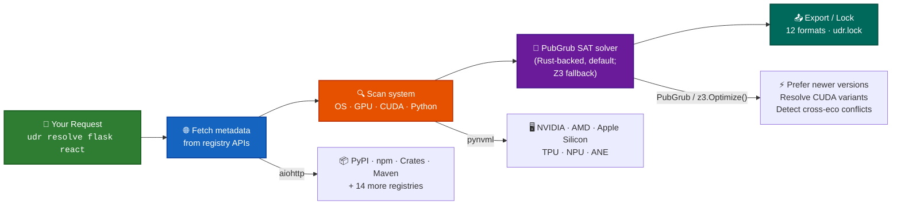

# 🚀 Universal Dependency Resolver

**Resolve any package, from any ecosystem, all at once.**

[](https://pypi.org/project/ud-resolver/)
[](https://pypi.org/project/ud-resolver/)
[](LICENSE)
[](https://github.com/code-with-zeeshan/universal-dependency-resolver/actions/workflows/ci.yml)
[](https://github.com/code-with-zeeshan/universal-dependency-resolver/actions/workflows/build-desktop.yml)
[](https://github.com/code-with-zeeshan/universal-dependency-resolver/actions)
[](https://github.com/code-with-zeeshan/universal-dependency-resolver/actions)
[](https://github.com/code-with-zeeshan/universal-dependency-resolver/actions)

---

## ✨ One tool. 20 ecosystems. Infinite possibilities.

```bash
udr resolve torch@pypi express@npm serde@crates
# ✅ Compatible versions across PyPI, npm, and Cargo
# 🎯 CUDA-aware: torch 2.1.2+cu121 (GPU) selected automatically
```

> **Say goodbye to fragmented dependency management.**  
> No more juggling `pip-compile`, `npm ls`, and `cargo tree` separately.

---

## 🎯 Why You Need This

| The old way | With UDR |
|---|---|
| 😤 Manage dependencies separately per ecosystem | 🎉 Resolve everything in one command |
| 😰 Cross-ecosystem conflicts caught at runtime | 🛡️ Detected & resolved at lock time |
| 🤷‍♂️ CUDA/GPU compatibility? Hope and pray | 🧠 Auto-detected and handled |
| 📝 Pin transitive deps manually | 🔗 SAT solver pins them automatically |
| 🐌 Slow, repetitive, error-prone | ⚡ Fast, cached, reproducible |

---

## 🚀 Quick Start

```bash
# 1️⃣ Install
pip install ud-resolver

# 2️⃣ Resolve packages from any ecosystem
udr resolve flask>=2.0 react@^18

# 3️⃣ Lock your entire project
udr lock

# 4️⃣ Check system compatibility
udr check

# 5️⃣ Start the API server
udr serve --port 8000
```

> 🎯 **Pro tip:** Add `[system]` for GPU detection: `pip install "ud-resolver[system]"`

---

## 💎 Features at a Glance

### 🌍 20 Supported Ecosystems

| ☁️ Cloud Native | 🐍 Dynamic | ☕ JVM & .NET | 📦 Package Managers | 🛠️ System |
|---|---|---|---|---|
| **PyPI** – Python | **npm** – JavaScript | **Maven** – Java | **CocoaPods** – Swift/ObjC | **APT** – Debian/Ubuntu |
| **Conda** – Multi-language | **Crates.io** – Rust | **Gradle** – Java/Kotlin | **NuGet** – .NET | **APK** – Alpine |
| **Go Modules** – Go | **RubyGems** – Ruby | **Pub** – Dart/Flutter | **Packagist** – PHP | **Homebrew** – macOS/Linux |
| | **Hex** – Elixir | **Swift** – Swift | | |
| | **Haskell** – Cabal | | **Docs DB** – Internal | |

### ⚡ Core Capabilities

| Feature | What it does |
|---|---|
| 🧠 **SAT-solver resolution** | PubGrub-powered solver (Rust-backed, default; Z3 fallback) finds compatible versions across all ecosystems simultaneously |
| 🖥️ **System-aware** | Detects OS, CPU, GPU, CUDA, Python, Node, GCC, Java — adapts resolution |
| 🎮 **GPU-aware** | Auto-selects CUDA variants (e.g. `torch 2.1.2+cu121`) when NVIDIA GPU detected |
| 📤 **15 export formats** | requirements.txt, Dockerfile, docker-compose.yml, pyproject.toml, Cargo.toml, pom.xml, build.gradle, CMakeLists.txt, install.sh, install.bat, environment.yml, package.json, Gemfile, composer.json, go.mod |
| 🎛️ **18 CLI commands** | serve, check, resolve, lock, scan, graph, verify, list-ecosystems, update, install, completion, why, outdated, diff, search, details, auth, index |
| 🌐 **49 REST API endpoints** | Full programmatic API with auto-generated Swagger docs |
| 🖥️ **Desktop GUI** | Standalone Electron app — no Python or Node.js required |
| 🔒 **Lock file** | Reproducible `udr.lock` with full system snapshot |
| 🚀 **Zero config** | SQLite by default, in-memory cache, no Docker required |

---

## 🧩 Components

| Component | What it is | How to get | Best for |
|---|---|---|---|
| 🖥️ **CLI** | Terminal tool with 17 commands | `pip install ud-resolver` | CI/CD, scripts, ad-hoc |
| 📚 **Python Library** | Importable `backend.*` modules | `pip install ud-resolver` | Embedding in tools |
| 🌐 **API Server** | FastAPI REST server + Swagger UI | `udr serve` | Programmatic access |
| 🖥️ **Desktop App** | Standalone Electron GUI | [GitHub Releases](https://github.com/code-with-zeeshan/universal-dependency-resolver/releases) | GUI users, no terminal |

See [docs/COMPONENTS.md](docs/COMPONENTS.md) for a detailed comparison.

---

## 🎬 CLI in Action

```bash
# Resolve from any ecosystem
udr resolve numpy pandas scikit-learn
udr resolve react vue -e npm
udr resolve serde tokio -e crates
udr resolve numpy@pypi express@npm               # mixed ecosystems

# Lock a project
udr lock
udr lock --manifest requirements.txt --dry-run    # preview only

# Validate & inspect
udr verify                                        # lock file valid?
udr graph flask django                            # dependency tree
udr why flask                                     # why this version?

# Scan remote repos without cloning
udr scan --github https://github.com/user/repo

# CUDA override on CPU-only machines
udr lock --cuda 12.1

# System info
udr check
udr list-ecosystems

# Update & search
udr update flask
udr search numpy --limit 50
udr details react -e npm
```

---

## 🐍 Use as a Python Library

```python
import asyncio
from backend.core.data_aggregator import DataAggregator
from backend.core.system_scanner import SystemScanner
from backend.orchestrator.resolve import create_solver

async def main():
    scanner = SystemScanner()
    system_info = await scanner.scan_all()

    aggregator = DataAggregator()
    info = await aggregator.get_package_info(
        "torch", ecosystem="pypi",
        include_dependencies=True, include_versions=True,
    )

    resolver = create_solver()
    result = resolver.resolve(
        [{"name": "flask", "version": ">=2.0"}],
        system_info=system_info,
    )

asyncio.run(main())
```

---

## 🌐 API Server

```bash
udr serve --host 0.0.0.0 --port 8000
```

📖 **Interactive docs:** [http://localhost:8000/api/v1/docs](http://localhost:8000/api/v1/docs) (Swagger UI)

Full reference in [docs/API.md](docs/API.md).

---

## 🔄 How It Works



See [docs/ARCHITECTURE.md](docs/ARCHITECTURE.md) for the full architecture deep-dive.

---

## 📊 By the Numbers

| Metric | Value |
|---|---|
| ✅ Supported ecosystems | **20** |
| 🧪 Unit tests passing | **2351** (+ 94 integration) |
| 🎛️ CLI commands | **18** |
| 🌐 API endpoints | **49** |
| 📤 Export formats | **15** |
| 📦 PyPI downloads | [](https://pepy.tech/project/ud-resolver) |
| 📄 Code | [](https://github.com/code-with-zeeshan/universal-dependency-resolver) |
| ⭐ Stars | [](https://github.com/code-with-zeeshan/universal-dependency-resolver) |

---

## 🧪 Testing

```bash
# All unit tests (fast, no network)
python -m pytest tests/unit/

# CLI end-to-end (black-box subprocess, real registries)
python -m pytest tests/e2e/test_cli_realworld.py

# Problem statement scenarios
python -m pytest tests/e2e/test_problem_statement.py

# JSON output compliance
python -m pytest tests/e2e/test_json_compliance.py

# Integration (SQLite, no Docker needed)
python -m pytest tests/integration/

# Comprehensive (system-aware, cross-ecosystem)
python -m pytest tests/test_comprehensive.py

# Desktop smoke tests
cd desktop && node --test tests/
```

---

## 📚 Documentation

| Guide | Description |
|---|---|
| 📖 [User Guide](docs/USER_GUIDE.md) | Everything in one place — prerequisites to production |
| 🎮 [CLI Reference](docs/CLI.md) | All 17 commands, flags, examples, exit codes |
| 🌐 [API Reference](docs/API.md) | 45 REST endpoints, request/response schemas |
| 🏗️ [Architecture](docs/ARCHITECTURE.md) | Codebase structure, layers, key decisions |
| 🛠️ [Development](docs/DEVELOPMENT.md) | Setup, running, testing, project structure |
| 🧩 [Components](docs/COMPONENTS.md) | CLI vs Desktop vs Library — which one for you |
| ☁️ [Deployment](docs/DEPLOYMENT.md) | Production deployment guide |
| 🔧 [Troubleshooting](docs/TROUBLESHOOTING.md) | Common issues and solutions |
| 🤝 [Contributing](CONTRIBUTING.md) | How to contribute |
| 🔒 [Security](SECURITY.md) | Security policy |

---

## 💬 Let's Connect

Found a bug? 🐛 [Open an issue](https://github.com/code-with-zeeshan/universal-dependency-resolver/issues)  
Want a feature? 💡 [Suggest it](https://github.com/code-with-zeeshan/universal-dependency-resolver/issues)  
Love the tool? ⭐ [Star the repo](https://github.com/code-with-zeeshan/universal-dependency-resolver)

---

## 📜 License

[MIT](LICENSE) — free for personal and commercial use. Go build something awesome! 🚀
