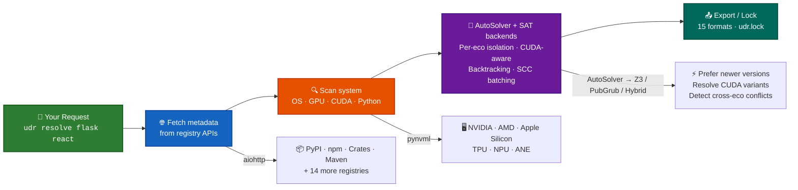

# 🚀 Universal Dependency Resolver

**Resolve any package, from any ecosystem, all at once.**

[](https://pypi.org/project/ud-resolver/)
[](https://pypi.org/project/ud-resolver/)
[](LICENSE)
[](https://github.com/code-with-zeeshan/universal-dependency-resolver/actions/workflows/ci.yml)
[](https://github.com/code-with-zeeshan/universal-dependency-resolver/actions/workflows/build-desktop.yml)
[](https://github.com/code-with-zeeshan/universal-dependency-resolver/actions)
[](https://github.com/code-with-zeeshan/universal-dependency-resolver/actions)
[](https://github.com/code-with-zeeshan/universal-dependency-resolver/actions)
[](https://github.com/code-with-zeeshan/universal-dependency-resolver/actions)
[](https://github.com/code-with-zeeshan/universal-dependency-resolver/issues)
[](https://github.com/code-with-zeeshan/universal-dependency-resolver/commits/main)

---

## Who is this for?

| You... | The problem | What UDR does |
|---|---|---|
| 🏗️ **Run a multi-language monorepo** | pip + npm + cargo + go — each its own lock file, each its own audit tool, each its own version scheme. The same dep pinned to different versions across ecosystems? No tool catches it. | One `udr.lock` across all ecosystems. `udr lock --check` in CI catches cross-ecosystem version drift before prod. |
| 🧠 **Deploy ML models with GPU deps** | torch + CUDA toolkit + nvidia-* wheels — wrong variant means silent CPU fallback or crash. Every ML team wastes days on this. | Auto-detects CUDA version, selects correct `torch+cu121` variant. CUDA 11-vs-12 conflict rules prevent incompatible pairs. |
| 🔒 **Own supply chain compliance** | Quarterly audits = run `pip-audit` + `npm audit` + `cargo audit` + `go list -m` + `bundler-audit` separately. | `udr check --cve` against OSV across **18 ecosystems** at once. `udr sbom` for SPDX/CycloneDX. Done. |

```bash
udr resolve torch@pypi express@npm serde@crates
# ✅ Compatible versions across PyPI, npm, and Cargo
# 🎯 CUDA-aware: torch 2.1.2+cu121 (GPU) selected automatically
```

> **Say goodbye to fragmented dependency management.**  
> No more juggling `pip-compile`, `npm ls`, and `cargo tree` separately.

---

## 🚀 Quick Start

```bash
# 1️⃣ Install
pip install ud-resolver

# 2️⃣ Resolve packages from any ecosystem
udr resolve flask>=2.0 react@^18

# 3️⃣ Lock your entire project
udr lock

# 4️⃣ Check system compatibility
udr check

# 5️⃣ Start the API server
udr serve --port 8000
```

> 🎯 **For full capacity**, install extras:
> - `[z3]` — Z3 SAT solver for CUDA XOR conflict rules + heavy cross-eco graphs. Without it, GPU version filtering still works (pre-filtered), but CUDA 11-vs-12 conflict detection is skipped.
> - `[pubgrub]` — Rust-backed PubGrub (faster on 100+ package graphs). Without it, pure-Python fallback handles most graphs fine.
> - `[system]` — Richer system data via Python libs (GPU temp/util, per-process memory, detailed CPU model). Without it, GPU/OS/CPU detection still works via `nvidia-smi`/`lspci`/`platform`.
>
> Recommended: `pip install "ud-resolver[z3,pubgrub,system]"`

---

## 💎 Features at a Glance

### 🌍 25 Supported Ecosystems (18 resolvable + 7 query-only)

| Resolvable | Resolvable (cont.) | Query-only (version info, no SAT) |
|---|---|---|
| **PyPI** – Python | **CocoaPods** – Swift/ObjC | **Nix** – NixOS |
| **Conda** – Multi-language | **NuGet** – .NET | **Guix** – GNU Guix |
| **npm** – JavaScript | **Packagist** – PHP | **Docker** – Containers |
| **Crates.io** – Rust | **Homebrew** – macOS/Linux | **Helm** – Kubernetes |
| **Maven** – Java | **Hex** – Elixir | **Terraform** – IaC |
| **Go Modules** – Go | **Swift** – Swift | **Vcpkg** – C/C++ |
| **APT** – Debian/Ubuntu | **Haskell** – Cabal | **Conan** – C/C++ |
| **APK** – Alpine | **Pub** – Dart/Flutter | |
| **RubyGems** – Ruby | **Gradle** – Java/Kotlin | |

Plus 2 internal registries (Docs DB, Custom DB) for system compatibility enrichment and local resolution caching. Query-only ecosystems provide version info, manifest parsing, lock-file parsing, and export, but don't participate in SAT-solver dependency traversal (their transitive deps are not auto-resolved).

### ⚡ Core Capabilities

| Feature | What it does |
|---|---|
| 🧠 **SAT-solver resolution** | AutoSolver (default, profiles graph → Z3/PubGrub/Hybrid per workload) with per-ecosystem isolation, SCC batch partitioning, CUDA-aware conflict resolution, and DFS backtracking fallback |
| 🖥️ **System-aware** | Detects OS, CPU, GPU, CUDA, Python, Node, GCC, Java — adapts resolution |
| 🎮 **GPU-aware** | Auto-selects CUDA variants (e.g. `torch 2.1.2+cu121`) when NVIDIA GPU detected |
| 📤 **15 export formats** | requirements.txt, package.json, Dockerfile, docker-compose.yml, pyproject.toml, environment.yml, Cargo.toml, build.gradle, pom.xml, CMakeLists.txt, install.sh, install.bat, Gemfile, composer.json, go.mod |
| 🎛️ **20 CLI commands** | serve, check, resolve, lock, scan, graph, verify, list-ecosystems, update, install, completion, why, outdated, diff, search, details, auth, index, sbom, tools |
| 🌐 **56 REST API endpoints** | Full programmatic API with auto-generated Swagger docs |
| 🖥️ **Desktop GUI** | Standalone Electron app — no Python or Node.js required |
| 🔒 **Lock file** | Reproducible `udr.lock` with full system snapshot |
| 🚀 **Zero config** | SQLite by default, in-memory cache, no Docker required |

---

## 🧩 Components

| Component | What it is | How to get | Best for |
|---|---|---|---|
| 🖥️ **CLI** | Terminal tool with 20 commands | `pip install ud-resolver` | CI/CD, scripts, ad-hoc |
| 📚 **Python Library** | Importable `backend.*` modules | `pip install ud-resolver` | Embedding in tools |
| 🌐 **API Server** | FastAPI REST server + Swagger UI | `udr serve` | Programmatic access |
| 🖥️ **Desktop App** | Standalone Electron GUI | [GitHub Releases](https://github.com/code-with-zeeshan/universal-dependency-resolver/releases) | GUI users, no terminal |

See [docs/COMPONENTS.md](docs/COMPONENTS.md) for a detailed comparison.

---

## 🎬 CLI in Action

```bash
# Resolve from any ecosystem
udr resolve numpy pandas scikit-learn
udr resolve react vue -e npm
udr resolve serde tokio -e crates
udr resolve numpy@pypi express@npm               # mixed ecosystems

# Lock a project
udr lock
udr lock --manifest requirements.txt --dry-run    # preview only

# Validate & inspect
udr verify                                        # lock file valid?
udr graph flask django                            # dependency tree
udr why flask                                     # why this version?

# Scan remote repos without cloning
udr scan --github https://github.com/user/repo

# CUDA override on CPU-only machines
udr lock --cuda 12.1

# System info
udr check
udr list-ecosystems

# Update & search
udr update flask
udr update --fix-cve                          # auto-fix known CVEs

# Generate SBOM
udr sbom --format spdx --output sbom.json

# Policy check & CI drift
udr check --policy                            # policy compliance
udr lock --check                              # CI drift detection

# Supply chain attestation
udr lock --sign                               # sign lock file
udr verify --signature                        # verify signature
udr search numpy --limit 50
udr details react -e npm
```

---

## 🐍 Use as a Python Library

```python
import asyncio
from backend.core.data_aggregator import DataAggregator
from backend.core.system_scanner import SystemScanner
from backend.orchestrator.resolve import create_solver

async def main():
    scanner = SystemScanner()
    system_info = await scanner.scan_all()

    aggregator = DataAggregator()
    info = await aggregator.get_package_info(
        "torch", ecosystem="pypi",
        include_dependencies=True, include_versions=True,
    )

    resolver = create_solver()
    result = resolver.resolve_dependencies(
        packages=[{"name": "flask", "version": ">=2.0"}],
        system_info=system_info,
    )

asyncio.run(main())
```

---

## 🌐 API Server

```bash
udr serve --host 0.0.0.0 --port 8000
```

📖 **Interactive docs:** [http://localhost:8000/api/v1/docs](http://localhost:8000/api/v1/docs) (Swagger UI)

Full reference in [docs/API.md](docs/API.md).

---

## 🔄 How It Works



See [docs/ARCHITECTURE.md](docs/ARCHITECTURE.md) for the full architecture deep-dive.

---

## 📊 By the Numbers

| Metric | Value |
|---|---|
| ✅ Supported ecosystems | **27** (25 user-facing: 18 resolvable + 7 query-only; 2 internal) |
| 🧪 Unit tests passing | **3334** (+ 96 integration + 77 e2e + 10 wheel + 94 cross-eco) |
| 🎛️ CLI commands | **20** |
| 🌐 API endpoints | **54** |
| 📤 Export formats | **15** |
| 📦 PyPI downloads | [](https://pepy.tech/project/ud-resolver) |
| 📄 Code | [](https://github.com/code-with-zeeshan/universal-dependency-resolver) |
| ⭐ Stars | [](https://github.com/code-with-zeeshan/universal-dependency-resolver) |

---

## 🧪 Testing

```bash
# All unit tests (fast, no network)
python -m pytest tests/unit/

# CLI end-to-end (black-box subprocess, real registries)
python -m pytest tests/e2e/test_cli_realworld.py

# Problem statement scenarios
python -m pytest tests/e2e/test_problem_statement.py

# JSON output compliance
python -m pytest tests/e2e/test_json_compliance.py

# Integration (SQLite, no Docker needed)
python -m pytest tests/integration/

# Comprehensive (system-aware, cross-ecosystem)
python -m pytest tests/test_comprehensive.py

# Desktop smoke tests
cd desktop && node --test tests/
```

---

## 📚 Documentation

| Guide | Description |
|---|---|
| 📖 [User Guide](docs/USER_GUIDE.md) | Everything in one place — prerequisites to production |
| 🎮 [CLI Reference](docs/CLI.md) | All 19 commands, flags, examples, exit codes |
| 🌐 [API Reference](docs/API.md) | 56 REST endpoints, request/response schemas |
| 🏗️ [Architecture](docs/ARCHITECTURE.md) | Codebase structure, layers, key decisions |
| 🛠️ [Development](docs/DEVELOPMENT.md) | Setup, running, testing, project structure |
| 🧩 [Components](docs/COMPONENTS.md) | CLI vs Desktop vs Library — which one for you |
| ☁️ [Deployment](docs/DEPLOYMENT.md) | Production deployment guide |
| 🔧 [Troubleshooting](docs/TROUBLESHOOTING.md) | Common issues and solutions |
| 🤝 [Contributing](CONTRIBUTING.md) | How to contribute |
| 🔒 [Security](SECURITY.md) | Security policy |

---

## 💬 Let's Connect

Found a bug? 🐛 [Open an issue](https://github.com/code-with-zeeshan/universal-dependency-resolver/issues)  
Want a feature? 💡 [Suggest it](https://github.com/code-with-zeeshan/universal-dependency-resolver/issues)  
Love the tool? ⭐ [Star the repo](https://github.com/code-with-zeeshan/universal-dependency-resolver)

---

## 📜 License

[MIT](LICENSE) — free for personal and commercial use. Go build something awesome! 🚀
