# API Reference

## Overview

**Base URL:** `http://localhost:8000` (configurable via `--host`/`--port`)

- **Swagger UI:** `http://localhost:8000/api/v1/docs`
- **Redoc:** `http://localhost:8000/api/v1/redoc`
- **OpenAPI schema:** `http://localhost:8000/api/v1/openapi.json`

### Run Modes

| Mode | Auth | Rate Limiting | Start Command |
|---|---|---|---|
| `local` | Anonymous user (API key middleware still active) | Yes | `udr serve` (default) |
| `saas` | JWT Bearer + API key + full auth stack | Yes | `udr serve --mode saas` |

In `local` mode, auth endpoints (`/api/v1/auth/*`) are **not mounted**. The `get_current_user` dependency returns an anonymous user. API key middleware still validates `X-API-Key` header against the `API_KEY` env var.

In `saas` mode (`ENABLE_AUTH=true`), all endpoints require authentication via:

1. **JWT Bearer** in `Authorization: Bearer <token>` header (from `/auth/login` or `/auth/token`)
2. **API key** in `X-API-Key` header

### Error Format

All errors return a consistent structure:

```json
{
  "error": {
    "message": "Package not found in ecosystem",
    "type": "http_error",
    "status_code": 404,
    "timestamp": "2026-06-28T12:00:00"
  }
}
```

Successful responses typically use `{"status": "success", ...}`. Error responses use the envelope above.

### Rate Limiting

Rate limits are per-endpoint (see endpoint tables below). When exceeded, returns `429 Too Many Requests`:

```json
{
  "error": {
    "message": "Rate limit exceeded: 10/minute",
    "type": "rate_limit_exceeded",
    "status_code": 429,
    "timestamp": "2026-06-28T12:00:00"
  }
}
```

Rate limiting uses slowapi with Redis (if `REDIS_URL` configured) or in-memory fallback.

### Request Flow

```mermaid
flowchart TD
    subgraph INCOMING["Incoming Request"]
        REQ["HTTP Request"]
    end

    subgraph MIDDLEWARE["Middleware Stack (11 layers, outer → inner)"]
        SLOWAPI["1. SlowAPIMiddleware<br/>rate limiting"]
        MAINT["2. MaintenanceModeMiddleware<br/>block when maintenance flag set"]
        SEC["3. SecurityHeadersMiddleware<br/>CSP, HSTS, X-Frame-Options"]
        SIZE["4. RequestSizeLimitMiddleware<br/>reject oversized bodies"]
        COMP["5. CompressionMiddleware<br/>gzip ≥ 1KB"]
        CACHE["6. CacheMiddleware<br/>response caching"]
        METRICS["7. MetricsMiddleware<br/>Prometheus counters"]
        PERF["8. PerformanceMiddleware<br/>log slow requests"]
        LOG["9. LoggingMiddleware<br/>structured request logging"]
        AUDIT["10. AuditLogMiddleware<br/>log mutating ops"]
        CSRF["11. CSRFProtectionMiddleware<br/>only when auth enabled"]
        CORR["12. CorrelationIDMiddleware<br/>X-Correlation-ID"]
    end

    subgraph ROUTING["Routing"]
        CORS["CORSMiddleware"]
        APIKEY["API Key Middleware<br/>X-API-Key check"]
        ROUTER["FastAPI Router<br/>9 route modules"]
        DI["Dependency Injection<br/>limiter, solver, scanner<br/>aggregator"]
    end

    subgraph HANDLER["Route Handler"]
        HAND["Endpoint function"]
        ORCH["orchestrator/resolve.py<br/>or DB service<br/>or scan logic"]
        RESULT["Build response dict"]
    end

    REQ --> SLOWAPI
    SLOWAPI --> MAINT
    MAINT --> SEC
    SEC --> SIZE
    SIZE --> COMP
    COMP --> CACHE
    CACHE --> METRICS
    METRICS --> PERF
    PERF --> LOG
    LOG --> AUDIT
    AUDIT --> CSRF
    CSRF --> CORR
    CORR --> CORS
    CORS --> APIKEY
    APIKEY --> ROUTER
    ROUTER --> DI
    DI --> HAND
    HAND --> ORCH
    ORCH --> RESULT
    RESULT -->|"JSON response"| REQ

    style INCOMING fill:#1a237e,color:#fff
    style MIDDLEWARE fill:#004d40,color:#fff
    style ROUTING fill:#e65100,color:#fff
    style HANDLER fill:#4a148c,color:#fff

    classDef box fill:#1a237e,color:#fff
    class REQ,SLOWAPI,MAINT,SEC,SIZE,COMP,CACHE,METRICS,PERF,LOG,AUDIT,CSRF,CORR,CORS,APIKEY,ROUTER,DI,HAND,ORCH,RESULT box
```



---

## Endpoint Summary

The API exposes **59 endpoints** across 9 route modules.

| # | Method | Path | Auth | Rate Limit | Module |
|---|---|---|---|---|---|
| | **Infrastructure** | | | | `main.py` |
| 1 | GET | `/` | No | 10/min | root |
| 2 | GET | `/healthz` | No | none | liveness |
| 3 | GET | `/readyz` | No | none | readiness |
| 4 | GET | `/api/v1/health` | Yes | 30/min | health |
| 5 | GET | `/metrics` | Token | none | Prometheus |
| | **Auth** (saas mode only) | | | | `auth.py` |
| 6 | POST | `/api/v1/auth/register` | No | 5/hour |
| 7 | POST | `/api/v1/auth/login` | No | 10/min |
| 8 | POST | `/api/v1/auth/token` | No | 10/min |
| 9 | POST | `/api/v1/auth/refresh` | No | 30/min |
| 10 | POST | `/api/v1/auth/logout` | Yes | 30/min |
| 11 | GET | `/api/v1/auth/profile` | Yes | 60/min |
| 12 | PUT | `/api/v1/auth/profile` | Yes | 10/min |
| 13 | POST | `/api/v1/auth/change-password` | Yes | 5/hour |
| 14 | GET | `/api/v1/auth/api-keys` | Yes | 30/min |
| 15 | POST | `/api/v1/auth/api-keys` | Yes | 10/day |
| 16 | DELETE | `/api/v1/auth/api-keys/{key_id}` | Yes | 30/min |
| 17 | GET | `/api/v1/auth/verify` | Yes | 60/min |
| 18 | POST | `/api/v1/auth/check-username` | No | 30/min |
| 19 | GET | `/api/v1/auth/signing-key` | Yes | 30/min |
| 20 | POST | `/api/v1/auth/gen-key` | Yes | 10/day |
| | **System** | | | | `system.py` |
| 21 | GET | `/api/v1/system/info` | Yes | 30/min |
| 22 | POST | `/api/v1/system/check-compatibility` | Yes | 10/min |
| | **Packages** | | | | `packages.py` |
| 23 | GET | `/api/v1/packages/ecosystems` | Yes | 60/min |
| 24 | GET | `/api/v1/packages/search` | Yes | 60/min |
| 25 | GET | `/api/v1/packages/{eco}/{name}/details` | Yes | 120/min |
| 26 | GET | `/api/v1/packages/{eco}/{name}/versions` | Yes | 120/min |
| 27 | GET | `/api/v1/packages/{eco}/{name}/dependencies` | Yes | 120/min |
| 28 | GET | `/api/v1/packages/{eco}/{name}/compatibility` | Yes | 120/min |
| 29 | POST | `/api/v1/packages/resolve` | Yes | 10/min |
| 30 | POST | `/api/v1/packages/export` | Yes | 20/min |
| 31 | GET | `/api/v1/packages/export-formats` | Yes | 60/min |
| | **Scan** | | | | `scan.py` |
| 32 | POST | `/api/v1/scan/github` | Yes | none |
| 33 | POST | `/api/v1/scan/upload` | Yes | none |
| 34 | POST | `/api/v1/scan/local` | Yes | none |
| | **Lock** | | | | `lock.py` |
| 35 | POST | `/api/v1/verify` | Yes | none |
| 36 | POST | `/api/v1/graph` | Yes | none |
| 37 | POST | `/api/v1/update` | Yes | none |
| 38 | POST | `/api/v1/generate-lock` | Yes | none |
| 39 | POST | `/api/v1/install-commands` | Yes | none |
| 40 | POST | `/api/v1/restore-commands` | Yes | none |
| 41 | POST | `/api/v1/why` | Yes | none |
| 42 | POST | `/api/v1/outdated` | Yes | none |
| 43 | POST | `/api/v1/diff` | Yes | none |
| 44 | POST | `/api/v1/lock/check` | Yes | none |
| 45 | POST | `/api/v1/lock/sign` | Yes | none |
| 46 | POST | `/api/v1/lock/update-with-fix` | Yes | none |
| 47 | POST | `/api/v1/lock/update-manifests` | Yes | none |
| 48 | POST | `/api/v1/lock/report` | Yes | none |
| 49 | POST | `/api/v1/lock/apply-pinning` | Yes | none |
| | **Index** | | | | `index.py` |
| 50 | GET | `/api/v1/index/status` | Yes | none |
| 51 | POST | `/api/v1/index/pull` | Yes | none |
| 52 | POST | `/api/v1/index/build` | Yes | none |
| 53 | POST | `/api/v1/index/sync-all` | Yes | none |
| | **Check** | | | | `check.py` |
| 54 | POST | `/api/v1/check/cve` | Key | 10/min |
| 55 | POST | `/api/v1/check/license` | Key | 10/min |
| 56 | POST | `/api/v1/check/deprecated` | Key | 10/min |
| 57 | POST | `/api/v1/check/policy` | Key | 10/min |
| 58 | POST | `/api/v1/check/all` | Key | 5/min |
| | **SBOM** | | | | `sbom.py` |
| 59 | POST | `/api/v1/sbom` | Key | 10/min |
| | **Completion** | | | | `completion.py` |
| 60 | GET | `/api/v1/completion/{shell}` | Yes | none |

**Auth key:** "No" = no auth required, "Yes" = `Depends(get_current_user)`, "Key" = API key middleware only (no `get_current_user` dependency), "Token" = custom auth middleware.

---

## Infrastructure Endpoints

### `GET /`

Root endpoint — returns API metadata and links.

**Rate limit:** 10/minute **Auth:** None

**Response:**

```json
{
  "name": "Universal Dependency Resolver API",
  "version": "1.4.1",
  "documentation": {
    "openapi": "/api/v1/docs",
    "redoc": "/api/v1/redoc"
  },
  "endpoints": {
    "health": "/api/v1/health",
    "system_info": "/api/v1/system/info",
    "package_info": "/api/v1/packages/{ecosystem}/{name}",
    "resolve": "/api/v1/packages/resolve",
    "export": "/api/v1/packages/export",
    "formats": "/api/v1/packages/export-formats"
  }
}
```

### `GET /healthz`

Liveness probe — returns `{"status": "ok"}` if the server is running.

**Rate limit:** none **Auth:** None (exempt from API key middleware)

### `GET /readyz`

Readiness probe — returns `{"status": "ok"}` if the server is ready to serve.

**Rate limit:** none **Auth:** None (exempt from API key middleware)

### `GET /api/v1/health`

Health check — verifies database connection and optional Redis connectivity.

**Rate limit:** 30/minute **Auth:** JWT Bearer or API key

**Response:**

```json
{
  "status": "healthy",
  "timestamp": "2026-06-28T12:00:00",
  "version": "1.4.1",
  "checks": {
    "database": {"status": "healthy"},
    "redis": {"status": "healthy"}
  }
}
```

If the database is unhealthy, overall `status` is `"unhealthy"`. Redis check is omitted if Redis is not configured.

### `GET /metrics`

Prometheus metrics endpoint (auto-instrumented).

**Rate limit:** none **Auth:** Via `_metrics_auth_middleware` (checks `API_KEY` env var or `X-API-Key` header)

**Status codes:**

| Code | Condition |
|---|---|
| `200` | Success (health, healthz, readyz) |
| `503` | Database unhealthy (health endpoint) |

---

## Auth Endpoints

Only mounted when `ENABLE_AUTH=true` (saas mode). All auth endpoints live under `/api/v1/auth/`.

---

### `POST /api/v1/auth/register`

Register a new user account.

**Rate limit:** 5/hour **Auth:** None

**Request body:**

```json
{
  "username": "johndoe",
  "email": "john@example.com",
  "password": "securepassword123",
  "full_name": "John Doe"
}
```

| Field | Type | Constraints |
|---|---|---|
| `username` | string | 3-50 characters, alphanumeric + underscore |
| `email` | string (EmailStr) | Valid email format |
| `password` | string | Minimum 8 characters |
| `full_name` | string or null | Optional |

**Response (201 Created):**

```json
{
  "id": 1,
  "username": "johndoe",
  "email": "john@example.com",
  "full_name": "John Doe",
  "is_active": true,
  "scopes": []
}
```

| Code | Condition |
|---|---|
| `201` | User created |
| `400` | Username or email taken, invalid email format |
| `429` | Rate limit exceeded |

### `POST /api/v1/auth/login`

Login with username/password and receive JWT tokens.

**Rate limit:** 10/minute **Auth:** None

**Request body:**

```json
{
  "username": "johndoe",
  "password": "securepassword123"
}
```

**Response:**

```json
{
  "access_token": "eyJhbGci...",
  "token_type": "bearer",
  "refresh_token": "dGhpcyBpcyBh..."
}
```

| Code | Condition |
|---|---|
| `200` | Login successful |
| `401` | Invalid credentials |

### `POST /api/v1/auth/token`

OAuth2-compatible token endpoint (form-encoded credentials).

**Rate limit:** 10/minute **Auth:** None

**Request body (form-data):**

| Field | Type | Required |
|---|---|---|
| `grant_type` | string | No (must be `"password"` if provided) |
| `username` | string | Yes |
| `password` | string | Yes |

**Response:** Same as `/login`.

### `POST /api/v1/auth/refresh`

Refresh an expired access token using a refresh token.

**Rate limit:** 30/minute **Auth:** None

**Query parameters:**

| Parameter | Type | Required | Description |
|---|---|---|---|
| `refresh_token` | string | Yes | Refresh token from `/login` or `/token` |

**Response:**

```json
{
  "access_token": "eyJhbGci...",
  "token_type": "bearer",
  "refresh_token": "bmV3IHJlZnJl..."
}
```

| Code | Condition |
|---|---|
| `200` | Token refreshed |
| `401` | Invalid or expired refresh token |

### `POST /api/v1/auth/logout`

Logout — client should discard tokens.

**Rate limit:** 30/minute **Auth:** JWT Bearer or API key

**Response:** `{"message": "Successfully logged out"}`

### `GET /api/v1/auth/profile`

Get the authenticated user's profile.

**Rate limit:** 60/minute **Auth:** JWT Bearer or API key

**Response:**

```json
{
  "id": 1,
  "username": "johndoe",
  "email": "john@example.com",
  "full_name": "John Doe",
  "is_active": true,
  "scopes": []
}
```

### `PUT /api/v1/auth/profile`

Update profile (full_name, email).

**Rate limit:** 10/minute **Auth:** JWT Bearer or API key

**Request body:**

```json
{
  "full_name": "John Updated",
  "email": "john.new@example.com"
}
```

Both fields optional — only provided fields are updated.

**Response:** Same as `GET /profile`.

| Code | Condition |
|---|---|
| `200` | Profile updated |
| `400` | Email already in use |

### `POST /api/v1/auth/change-password`

Change the authenticated user's password.

**Rate limit:** 5/hour **Auth:** JWT Bearer or API key

**Request body:**

```json
{
  "current_password": "oldpassword123",
  "new_password": "newpassword456"
}
```

**Response:** `{"message": "Password changed successfully"}`

| Code | Condition |
|---|---|
| `200` | Password changed |
| `400` | Current password is incorrect |

### `GET /api/v1/auth/api-keys`

List the user's active API keys (key values are masked — only last 8 chars shown).

**Rate limit:** 30/minute **Auth:** JWT Bearer or API key

**Response:**

```json
[
  {
    "id": 1,
    "name": "CI pipeline",
    "key": "********************aBcDeFgH",
    "description": "Used for GitHub Actions",
    "scopes": ["read"],
    "created_at": "2026-06-01T12:00:00",
    "expires_at": "2027-06-01T12:00:00"
  }
]
```

### `POST /api/v1/auth/api-keys`

Create a new API key. The full key is returned **only once** — store it immediately.

**Rate limit:** 10/day **Auth:** JWT Bearer or API key

**Request body:**

```json
{
  "name": "CI pipeline",
  "description": "Used for GitHub Actions",
  "scopes": ["read"],
  "expires_at": "2027-06-01T12:00:00"
}
```

| Field | Type | Constraints |
|---|---|---|
| `name` | string | 3-100 characters |
| `description` | string or null | Optional |
| `scopes` | array of string | e.g. `["read"]`, `["read", "write"]` |
| `expires_at` | datetime or null | Optional expiration |

**Response:**

```json
{
  "id": 1,
  "name": "CI pipeline",
  "key": "udr_abc123def456...",
  "description": "Used for GitHub Actions",
  "scopes": ["read"],
  "created_at": "2026-06-28T12:00:00",
  "expires_at": "2027-06-01T12:00:00"
}
```

The `key` field contains the full plaintext key — this is the **only** time it is returned.

### `DELETE /api/v1/auth/api-keys/{key_id}`

Revoke an API key by ID.

**Rate limit:** 30/minute **Auth:** JWT Bearer or API key

**Path parameters:** `key_id: int`

**Response:** `{"message": "API key revoked successfully"}`

| Code | Condition |
|---|---|
| `200` | Key revoked |
| `404` | Key not found or doesn't belong to user |

### `GET /api/v1/auth/verify`

Verify that the current token is valid.

**Rate limit:** 60/minute **Auth:** JWT Bearer or API key

**Response:**

```json
{
  "valid": true,
  "username": "johndoe",
  "user_id": 1
}
```

### `POST /api/v1/auth/check-username`

Check if a username is available for registration.

**Rate limit:** 30/minute **Auth:** None

**Query parameters:**

| Parameter | Type | Required | Description |
|---|---|---|---|
| `email_or_username` | string | Yes | Username or email to check |

**Response:**

```json
{
  "available": true
}
```

### `GET /api/v1/auth/signing-key`

Show the current Ed25519 public signing key for lock file signing. Mirrors `udr auth show-key`.

**Rate limit:** 30/minute **Auth:** JWT Bearer or API key

**Response:**

```json
{
  "status": "success",
  "algorithm": "Ed25519",
  "public_key_base64": "MCowBQYDK2VwAyEA...",
  "fingerprint": "a1b2c3d4e5f6...",
  "key_directory": "/home/user/.config/udr"
}
```

| Code | Condition |
|---|---|
| `200` | Key shown |
| `404` | No signing key found |

### `POST /api/v1/auth/gen-key`

Generate a new Ed25519 signing key pair for lock file signing. Keys stored at `~/.config/udr/`. Mirrors `udr auth gen-key`.

**Rate limit:** 10/day **Auth:** JWT Bearer or API key

**Response (201 Created):**

```json
{
  "status": "success",
  "message": "Ed25519 signing key generated",
  "public_key_base64": "MCowBQYDK2VwAyEA...",
  "fingerprint": "a1b2c3d4e5f6...",
  "key_directory": "/home/user/.config/udr"
}
```

| Code | Condition |
|---|---|
| `201` | Key generated |
| `500` | Key generation failed |

---

## System Endpoints

### `GET /api/v1/system/info`

Get system information (OS, CPU, GPU, CUDA, Python version, runtimes).

**Rate limit:** 30/minute **Auth:** JWT Bearer or API key

**Query parameters:**

| Parameter | Type | Default | Description |
|---|---|---|---|
| `detailed` | bool | `false` | Return full system scan output |

**Response (non-detailed):**

```json
{
  "status": "success",
  "system": {
    "os": "Linux 6.2.0",
    "cpu": "Intel(R) Xeon(R)",
    "gpu": "NVIDIA A100",
    "cuda": "12.1",
    "python": "3.11.5"
  }
}
```

**Response (detailed):**

```json
{
  "status": "success",
  "data": {
    "platform": {"system": "Linux", "release": "6.2.0", "machine": "x86_64"},
    "cpu": {"brand": "Intel(R) Xeon(R)", "architecture": "x86_64", "count_logical": 8, "count_physical": 4},
    "memory": {"total": 33456789000, "available": 28000000000, "percent": 16.3},
    "gpu": {"available": true, "devices": [{"name": "NVIDIA A100", "memory_total": 40960}], "cuda": "12.1"},
    "runtime_versions": {"python": {"version": "3.11.5", "path": "/usr/bin/python3"}}
  }
}
```

### `POST /api/v1/system/check-compatibility`

Check if the system meets specified hardware/software requirements.

**Rate limit:** 10/minute **Auth:** JWT Bearer or API key

**Request body:**

```json
{
  "requirements": [
    {"type": "gpu", "minimum": {"cuda": "11.8", "memory_gb": 8}, "required": true},
    {"type": "memory", "minimum": {"gb": 16}, "required": true}
  ],
  "packages": ["tensorflow", "pytorch"]
}
```

**Supported requirement types:**

| Type | Checks | Minimum fields |
|---|---|---|
| `gpu` | GPU available, CUDA version, GPU memory, compute capability | `cuda`, `memory_gb`, `compute_capability` |
| `cpu` | Core count, CPU features, architecture | `cores`, `features`, `architecture` |
| `memory` | Total RAM, available RAM | `gb` |
| `disk` | Disk space, disk type | `gb`, `type` |
| `os` | OS name, version | `name`, `version` |
| `python` | Python version | `version` |
| `compiler` | Compiler installed (gcc, g++, clang, msvc) | compiler name → version |

**Response:**

```json
{
  "status": "success",
  "results": {
    "compatible": true,
    "checks": [
      {"type": "gpu", "status": "pass", "message": "", "details": {}}
    ],
    "warnings": [],
    "errors": [],
    "recommendations": [],
    "package_compatibility": {
      "pytorch": [{"type": "gpu", "status": "pass", "message": ""}]
    }
  }
}
```

---

## Package Endpoints

### `GET /api/v1/packages/ecosystems`

List all supported package ecosystems with capabilities.

**Rate limit:** 60/minute **Auth:** JWT Bearer or API key

**Response:**

```json
{
  "status": "success",
  "ecosystems": {
    "pypi": {
      "name": "Python Package Index",
      "language": "Python",
      "package_manager": "pip",
      "supports_search": true,
      "supports_versions": true,
      "supports_dependencies": true
    }
  },
  "total": 25
}
```

**Ecosystems (18 resolvable, 7 query-only):**

| Key | Language | Package Manager | Resolvable |
|---|---|---|---|
| `pypi` | Python | pip | Yes |
| `npm` | JavaScript/TypeScript | npm/yarn | Yes |
| `conda` | Python/Multi | conda | Yes |
| `maven` | Java | maven/gradle | Yes |
| `crates` | Rust | cargo | Yes |
| `gomodules` | Go | go mod | Yes |
| `nuget` | C#/.NET | dotnet/nuget | Yes |
| `rubygems` | Ruby | gem/bundler | Yes |
| `packagist` | PHP | composer | Yes |
| `cocoapods` | Objective-C/Swift | cocoapods | Yes |
| `homebrew` | System | brew | Yes |
| `apt` | Debian/Ubuntu | apt-get | Yes |
| `apk` | Alpine | apk | Yes |
| `pub` | Dart/Flutter | dart pub | Yes |
| `gradle` | Java/Kotlin | gradle | Yes |
| `swift` | Swift | swift | Yes |
| `hex` | Elixir | mix | Yes |
| `haskell` | Haskell | cabal/stack | Yes |
| `nix` | NixOS | nix | Query only |
| `guix` | GNU Guix | guix | Query only |
| `docker` | Container | docker | Query only |
| `helm` | Kubernetes | helm | Query only |
| `terraform` | Infrastructure | terraform | Query only |
| `vcpkg` | C++ | vcpkg | Query only |
| `conan` | C/C++ | conan | Query only |

### `GET /api/v1/packages/search`

Search for packages across multiple ecosystems.

**Rate limit:** 60/minute **Auth:** JWT Bearer or API key

**Query parameters:**

| Parameter | Type | Default | Description |
|---|---|---|---|
| `q` | string | (required) | Search query |
| `ecosystems` | string | `null` | Comma-separated list (e.g. `pypi,npm`) |
| `limit` | int | `20` | Max results per ecosystem (1–100) |
| `sort_by` | string | `relevance` | Sort order: `relevance`, `downloads`, `name`, `updated` |
| `python_version` | string | `null` | Filter by Python version (e.g. `3.9`) |

**Response:**

```json
{
  "status": "success",
  "query": "numpy",
  "total_count": 42,
  "results": {
    "pypi": [
      {"name": "numpy", "version": "1.26.0", "summary": "NumPy is the fundamental package for array computing with Python"}
    ],
    "conda": []
  },
  "filters_applied": {
    "ecosystems": null,
    "python_version": null,
    "sort_by": "relevance"
  }
}
```

### `GET /api/v1/packages/{ecosystem}/{package_name}/details`

Get detailed information about a specific package.

**Rate limit:** 120/minute **Auth:** JWT Bearer or API key

**Path parameters:** `ecosystem` (string), `package_name` (string)

**Query parameters:**

| Parameter | Type | Default | Description |
|---|---|---|---|
| `include_metrics` | bool | `false` | Include download/usage metrics |

**Response:**

```json
{
  "status": "success",
  "data": {
    "name": "numpy",
    "ecosystem": "pypi",
    "info": {
      "summary": "NumPy is the fundamental package...",
      "home_page": "https://numpy.org",
      "license": "BSD-3-Clause",
      "versions": ["1.26.0", "1.25.2"],
      "dependencies": {}
    },
    "compatibility_matrix": {},
    "system_requirements": {},
    "compatibility_summary": {"overall": "high", "issues": []}
  }
}
```

| Code | Condition |
|---|---|
| `200` | Success |
| `404` | Package not found |

### `GET /api/v1/packages/{ecosystem}/{package_name}/versions`

Get all available versions of a package with filtering.

**Rate limit:** 120/minute **Auth:** JWT Bearer or API key

**Path parameters:** `ecosystem` (string), `package_name` (string)

**Query parameters:**

| Parameter | Type | Default | Description |
|---|---|---|---|
| `compatible_with` | string | `null` | System spec filter: `os=linux,python=3.9,cuda=11.2` |
| `include_yanked` | bool | `false` | Include yanked/deprecated versions |
| `include_prerelease` | bool | `false` | Include pre-release versions |

**Response:**

```json
{
  "status": "success",
  "package": "numpy",
  "ecosystem": "pypi",
  "total_versions": 42,
  "filtered_count": 3,
  "versions": [
    {"version": "1.26.0", "yanked": false, "requires_python": ">=3.9", "upload_time": "2023-09-16T12:00:00"}
  ],
  "filters": {
    "compatible_with": null,
    "include_yanked": false,
    "include_prerelease": false
  }
}
```

| Code | Condition |
|---|---|
| `200` | Success |
| `400` | Unknown ecosystem |

### `GET /api/v1/packages/{ecosystem}/{package_name}/dependencies`

Get dependencies for a specific package.

**Rate limit:** 120/minute **Auth:** JWT Bearer or API key

**Path parameters:** `ecosystem` (string), `package_name` (string)

**Query parameters:**

| Parameter | Type | Default | Description |
|---|---|---|---|
| `version` | string | `null` (latest) | Specific version to inspect |
| `recursive` | bool | `false` | Get full transitive dependency tree |
| `max_depth` | int | `3` | Maximum recursion depth (1–5) |

**Response (non-recursive):**

```json
{
  "status": "success",
  "package": "numpy",
  "version": "1.26.0",
  "dependencies": []
}
```

**Response (recursive):**

```json
{
  "status": "success",
  "package": "pandas",
  "version": "2.1.3",
  "dependency_tree": {
    "name": "pandas",
    "version": "2.1.3",
    "dependencies": {
      "numpy": {"name": "numpy", "version": ">=1.23.2", "dependencies": {}}
    }
  },
  "total_dependencies": 1
}
```

### `GET /api/v1/packages/{ecosystem}/{package_name}/compatibility`

Get known compatibility information for a package.

**Rate limit:** 120/minute **Auth:** JWT Bearer or API key

**Path parameters:** `ecosystem` (string), `package_name` (string)

**Query parameters:**

| Parameter | Type | Default | Description |
|---|---|---|---|
| `version` | string | `null` | Specific version to check |

**Response:**

```json
{
  "status": "success",
  "package": "numpy",
  "ecosystem": "pypi",
  "version": "1.26.0",
  "compatibility": {
    "known_conflicts": [],
    "verified_combinations": [],
    "system_requirements": {},
    "version_specific": {},
    "community_reports": [],
    "statistics": {}
  }
}
```

### `POST /api/v1/packages/resolve`

Resolve dependencies for multiple packages. Returns SAT-solved compatible versions.

**Rate limit:** 10/minute **Auth:** JWT Bearer or API key

**Request body:**

```json
{
  "packages": [
    {"name": "numpy", "ecosystem": "pypi", "version": ">=1.20"},
    {"name": "express", "ecosystem": "npm", "version": "^4.18"}
  ],
  "system_info": {"gpu": {"available": true, "cuda": "12.1"}},
  "auto_detect_system": true,
  "prefer_compatibility": true
}
```

| Field | Type | Default | Description |
|---|---|---|---|
| `packages` | array | (required) | Package specs with name, ecosystem, optional version constraint |
| `system_info` | object | `null` | Override auto-detected system info |
| `auto_detect_system` | bool | `true` | Auto-detect system hardware |
| `prefer_compatibility` | bool | `true` | Prefer versions known to be compatible |

**Response:**

```json
{
  "status": "success",
  "data": {
    "resolved_packages": {
      "numpy": {"version": "1.26.0", "ecosystem": "pypi"},
      "pandas": {"version": "2.1.3", "ecosystem": "pypi"}
    },
    "warnings": []
  }
}
```

| Code | Condition |
|---|---|
| `200` | Resolution complete |
| `400` | Invalid package data |
| `500` | Internal resolution error |

### `POST /api/v1/packages/export`

Export resolved dependencies to a specific format.

**Rate limit:** 20/minute **Auth:** JWT Bearer or API key

**Request body:**

```json
{
  "resolved_packages": {"numpy": {"version": "1.26.0", "ecosystem": "pypi"}},
  "format": "requirements.txt",
  "system_info": {"os": "Linux", "python": "3.11"},
  "options": {}
}
```

**Response:**

```json
{
  "status": "success",
  "format": "requirements.txt",
  "content": "numpy==1.26.0\npandas==2.1.3\n"
}
```

### `GET /api/v1/packages/export-formats`

List all available export formats.

**Rate limit:** 60/minute **Auth:** JWT Bearer or API key

**Response:**

```json
{
  "status": "success",
  "formats": [
    {"format": "requirements.txt", "ecosystem": "pypi", "description": "Python pip requirements"},
    {"format": "Dockerfile", "ecosystem": "pypi", "description": "Docker image with Python dependencies"}
  ]
}
```

---

## Scan Endpoints

Scan endpoints run the full resolution pipeline (manifest detection → fetch metadata → SAT resolution) on external projects.

### `POST /api/v1/scan/github`

Scan a GitHub repository by URL. Downloads as zipball, detects manifests, resolves dependencies.

**Auth:** JWT Bearer or API key

**Query parameters:**

| Parameter | Type | Default | Description |
|---|---|---|---|
| `export` | string | `null` | Export format (e.g. `requirements.txt`) |

**Request body:**

```json
{
  "repo_url": "https://github.com/user/repo",
  "branch": "main"
}
```

**Response:**

```json
{
  "status": "success",
  "source": "github",
  "repo_url": "https://github.com/user/repo",
  "manifests": [{"filename": "requirements.txt", "ecosystem": "pypi"}],
  "packages": [
    {
      "name": "numpy", "ecosystem": "pypi", "constraint": ">=1.20",
      "resolved_version": "1.26.0", "cuda_variant": false, "cuda_version": null
    }
  ],
  "resolution": {"resolved_packages": {"numpy": {"version": "1.26.0"}}},
  "system": {"os": "Linux 6.2.0", "python": "3.11.5", "cpu": "Intel(R) Xeon(R)", "gpu": "NVIDIA A100", "cuda": "12.1"},
  "export": null
}
```

**Status values:** `"success"`, `"no_manifests"`, `"no_packages"`

| Code | Condition |
|---|---|
| `200` | Scan complete (check `status` field) |
| `400` | Invalid GitHub URL |

### `POST /api/v1/scan/upload`

Upload a ZIP archive of a project. Extracts, detects manifests, resolves dependencies.

**Auth:** JWT Bearer or API key

**Query parameters:**

| Parameter | Type | Default | Description |
|---|---|---|---|
| `export` | string | `null` | Export format |

**Request body:** `multipart/form-data` with `file` field (binary ZIP)

**Response:** Same structure as `/scan/github`, with `source: "upload"` and `filename` field.

| Code | Condition |
|---|---|
| `200` | Scan complete |
| `400` | Not a ZIP or illegal paths |

### `POST /api/v1/scan/local`

Scan a local project two ways: a server-side directory path, or in-memory `manifest_contents` (same shape as `/generate-lock`) when the backend runs elsewhere. Works when backend runs on the same machine for `directory_path`.

**Auth:** JWT Bearer or API key

**Query parameters:**

| Parameter | Type | Default | Description |
|---|---|---|---|
| `export` | string | `null` | Export format |

**Request body (directory mode):**

```json
{
  "directory_path": "/home/user/projects/myapp"
}
```

**Request body (manifest-content mode):**

```json
{
  "manifest_contents": {
    "requirements.txt": "flask>=2.0\n",
    "package.json": "{\"dependencies\": {\"express\": \"^4.18.0\"}}"
  }
}
```

Provide exactly one of `directory_path` or `manifest_contents`.

**Response:** Same structure as `/scan/github`, with `source: "local"` (and `directory_path` in directory mode).

| Code | Condition |
|---|---|
| `200` | Scan complete |
| `400` | Directory does not exist, no arguments, or both arguments provided |

---

## Lock Endpoints

Lock endpoints mirror CLI lock operations. They accept and return lock data as JSON — no filesystem access required.

### `POST /api/v1/generate-lock`

Generate a `udr.lock` structure from project manifests or pre-parsed package data. Supports two modes:

1. **Pre-parsed mode**: POST `packages`, `manifests`, `system`, `resolution`.
2. **Manifest content mode**: POST `manifest_contents` as `{filename: content}` dict.

**Auth:** JWT Bearer or API key

**Query parameters:**

| Parameter | Type | Default | Description |
|---|---|---|---|
| `export_format` | string | — | Optional export format (e.g. `requirements.txt`) |

**Request body (pre-parsed mode):**

```json
{
  "packages": [
    {"name": "numpy", "ecosystem": "pypi", "resolved_version": "1.26.0", "constraint": ">=1.20", "source": "requirements.txt"}
  ],
  "manifests": [{"filename": "requirements.txt", "ecosystem": "pypi"}],
  "system": {"platform": {}, "cpu": {}, "gpu": {"cuda": "12.1"}, "runtime_versions": {"python": {"version": "3.11.5"}}},
  "resolution": {"resolved_packages": {}, "warnings": []}
}
```

**Alternative request body (manifest content mode):**

```json
{
  "manifest_contents": {
    "requirements.txt": "numpy>=1.20\nflask>=2.0\n"
  },
  "block": ["jinja2", "markupsafe"],
  "pin": ["flask==3.1.3"],
  "pin_mode": "none"
}
```

| Field | Type | Default | Description |
|---|---|---|---|
| `manifest_contents` | dict | — | Filename → content map of manifests to resolve |
| `manifest_filter` | string | `null` | Restrict to a single manifest file |
| `system` | dict | `null` | Override auto-detected system info |
| `block` | list[string] | `[]` | Exclude packages from resolution (roots and transitives) — mirrors `udr lock --block` |
| `pin` | list[string] | `[]` | Pin packages to exact versions, e.g. `"flask==3.1.3"` — mirrors `udr lock --pin` |
| `pin_mode` | string | `"none"` | Pin policy mode: `none`, `major`, `minor`, `patch` |

**Response:**

```json
{
  "status": "success",
  "lock_data": {
    "version": "2.1",
    "generated_at": "2026-07-05T12:00:00",
    "resolver": "sat",
    "system": {"os": "Linux 6.2.0", "python": "3.11.5", "cpu": "Intel(R) Xeon(R)", "gpu": "NVIDIA A100", "cuda": "12.1"},
    "manifests": ["requirements.txt"],
    "packages": {
      "numpy": {
        "name": "numpy", "ecosystem": "pypi", "resolved_version": "1.26.0",
        "direct": true, "cuda_variant": false, "cuda_version": null,
        "original_constraint": ">=1.20", "source": "requirements.txt", "vulnerabilities": []
      }
    },
    "warnings": []
  }
}
```

When `?export_format=` is specified, the response also includes `export_content` and `export_format`.

| Code | Condition |
|---|---|
| `200` | Lock generated |
| `400` | Invalid request data |

### `POST /api/v1/verify`

Validate a lock file — check that every resolved version still exists in its registry. Mirrors `udr verify`.

**Auth:** JWT Bearer or API key

**Request body:**

```json
{
  "lock_data": {
    "packages": {
      "numpy": {"ecosystem": "pypi", "resolved_version": "1.26.0"},
      "old-package": {"ecosystem": "pypi", "resolved_version": "0.5.0"}
    }
  }
}
```

**Response:**

```json
{
  "status": "ok",
  "total": 2,
  "ok": 1,
  "issues": [
    {"name": "old-package", "issue": "Version 0.5.0 no longer available", "severity": "error"}
  ]
}
```

Severity: `"error"` (version not found) or `"warning"` (unresolved package). Overall `status` is `"ok"` if no errors, `"issues"` if any errors.

### `POST /api/v1/graph`

Get dependency trees for one or more packages. Mirrors `udr graph`.

**Auth:** JWT Bearer or API key

**Request body:**

```json
{
  "packages": ["numpy", "pandas"],
  "ecosystem": "pypi"
}
```

**Response:**

```json
{
  "status": "success",
  "trees": [
    {"name": "numpy", "version": "1.26.0", "ecosystem": "pypi", "children": []},
    {
      "name": "pandas", "version": "2.1.3", "ecosystem": "pypi",
      "children": [{"name": "numpy", "version": ">=1.23.2", "ecosystem": "pypi", "children": []}]
    }
  ]
}
```

### `POST /api/v1/update`

Re-resolve a single package and return updated lock data. Mirrors `udr update`.

**Auth:** JWT Bearer or API key

**Request body:**

```json
{
  "lock_data": {
    "packages": {
      "flask": {"ecosystem": "pypi", "resolved_version": "2.0.0"}
    }
  },
  "package": "flask",
  "ecosystem": "pypi"
}
```

`ecosystem` is optional — defaults to the value in `lock_data.packages[package].ecosystem`.

**Response:**

```json
{
  "status": "success",
  "package": "flask",
  "old_version": "2.0.0",
  "new_version": "3.0.0",
  "updated": true,
  "lock_data": {
    "packages": {"flask": {"ecosystem": "pypi", "resolved_version": "3.0.0", "cuda_variant": false, "cuda_version": null}},
    "generated_at": "2026-06-28T12:00:00"
  }
}
```

### `POST /api/v1/install-commands`

Generate native package manager install commands for **direct** dependencies from lock data. Mirrors `udr install --dry-run`.

**Auth:** JWT Bearer or API key

**Request body:**

```json
{
  "lock_data": {
    "packages": {
      "numpy": {"ecosystem": "pypi", "resolved_version": "1.26.0", "direct": true}
    }
  }
}
```

**Response:**

```json
{
  "status": "success",
  "commands": [
    {"ecosystem": "pypi", "command": "pip install numpy==1.26.0", "package_count": 1}
  ],
  "total_packages": 1
}
```

### `POST /api/v1/restore-commands`

Generate install commands for **all** packages (direct + transitive). Mirrors `udr install --restore --dry-run`.

**Auth:** JWT Bearer or API key

**Request body:** Same as `/install-commands`.

**Response:** Same structure, but includes all packages.

### `POST /api/v1/why`

Explain why a package version was selected — dependency chain, direct/transitive status, constraint. Mirrors `udr why`.

**Auth:** JWT Bearer or API key

**Request body:**

```json
{
  "lock_data": {
    "packages": {
      "flask": {"ecosystem": "pypi", "resolved_version": "2.3.3", "direct": true, "original_constraint": ">=2.0"},
      "click": {"ecosystem": "pypi", "resolved_version": "8.1.7", "direct": false, "original_constraint": "*"}
    }
  },
  "package": "click"
}
```

**Response:**

```json
{
  "status": "success",
  "package": "click",
  "version": "8.1.7",
  "ecosystem": "pypi",
  "direct": false,
  "original_constraint": "*",
  "source": "transitive",
  "dependency_chain": [
    {"package": "flask", "version": "2.3.3", "required_as": ">=8.0"}
  ]
}
```

For direct dependencies, `dependency_chain` is an empty array.

| Code | Condition |
|---|---|
| `200` | Info returned |
| `404` | Package not found in lock data |

### `POST /api/v1/outdated`

Check all packages in lock data against registries for newer versions. Mirrors `udr outdated --json`.

**Auth:** JWT Bearer or API key

**Request body:**

```json
{
  "lock_data": {
    "packages": {
      "numpy": {"ecosystem": "pypi", "resolved_version": "1.25.0", "direct": true}
    }
  },
  "ecosystem": "pypi"
}
```

`ecosystem` is optional — if provided, only checks packages from that ecosystem.

**Response:**

```json
{
  "status": "success",
  "outdated_count": 1,
  "packages": [
    {"name": "numpy", "ecosystem": "pypi", "current": "1.25.0", "latest": "1.26.0", "type": "direct"}
  ]
}
```

### `POST /api/v1/diff`

Compare two lock data objects and report package differences. Mirrors `udr diff --json`.

**Auth:** JWT Bearer or API key

**Request body:**

```json
{
  "lock_a": {"packages": {"numpy": {"ecosystem": "pypi", "resolved_version": "1.25.0"}}},
  "lock_b": {"packages": {"numpy": {"ecosystem": "pypi", "resolved_version": "1.26.0"}}}
}
```

**Response:**

```json
{
  "status": "success",
  "added": [],
  "removed": [],
  "changed": [
    {"name": "numpy", "ecosystem": "pypi", "from": "1.25.0", "to": "1.26.0"}
  ],
  "unchanged_count": 0
}
```

### `POST /api/v1/lock/check`

CI drift detection — re-resolves manifests and compares against existing lock data. Mirrors `udr lock --check`.

**Auth:** JWT Bearer or API key

**Request body:**

```json
{
  "manifest_contents": {
    "requirements.txt": "numpy>=1.20\nflask>=2.0\n"
  },
  "existing_lock_data": {
    "packages": {
      "numpy": {"ecosystem": "pypi", "resolved_version": "1.26.0", "direct": true}
    }
  }
}
```

**Response (no drift):**

```json
{
  "status": "ok",
  "drift_detected": false,
  "added": [],
  "removed": [],
  "changed": [],
  "unchanged_count": 5
}
```

**Response (drift detected):**

```json
{
  "status": "drift",
  "drift_detected": true,
  "added": [{"name": "new-pkg", "version": "1.0.0", "ecosystem": "pypi"}],
  "removed": [{"name": "old-pkg", "version": "0.5.0", "ecosystem": "pypi"}],
  "changed": [{"name": "numpy", "ecosystem": "pypi", "from": "1.25.0", "to": "1.26.0"}],
  "unchanged_count": 3
}
```

### `POST /api/v1/lock/sign`

Sign lock data with Ed25519 key. Mirrors `udr lock --sign`.

**Auth:** JWT Bearer or API key

**Request body:**

```json
{
  "lock_data": {"packages": {}}
}
```

**Response:**

```json
{
  "status": "success",
  "lock_data": {
    "packages": {},
    "signature": {"algorithm": "ed25519", "value": "base64...", "public_key": "base64..."}
  },
  "signature": "base64...",
  "public_key": "base64...",
  "algorithm": "ed25519"
}
```

| Code | Condition |
|---|---|
| `200` | Signed |
| `400` | No signing key found |

### `POST /api/v1/lock/update-with-fix`

Check packages for known CVEs and auto-bump to fixed versions. Mirrors `udr update --fix-cve`.

**Auth:** JWT Bearer or API key

**Request body:**

```json
{
  "lock_data": {"packages": {"numpy": {"ecosystem": "pypi", "resolved_version": "1.24.0"}}},
  "package": "numpy"
}
```

If `package` is omitted, all packages are checked.

**Response:**

```json
{
  "status": "success",
  "fixes": {"numpy": "1.24.3"},
  "lock_data": {"packages": {"numpy": {"ecosystem": "pypi", "resolved_version": "1.24.0", "constraint": ">=1.24.3"}}}
}
```

### `POST /api/v1/lock/update-manifests`

Suggest version bump targets from lock data (analysis only — no filesystem writes).

**Auth:** JWT Bearer or API key

**Request body:**

```json
{
  "lock_data": {"packages": {"flask": {"ecosystem": "pypi", "resolved_version": "3.0.0", "constraint": ">=2.0"}}},
  "manifest_contents": {"requirements.txt": "flask>=2.0\n"}
}
```

**Response:**

```json
{
  "status": "success",
  "suggestions": {
    "pypi": [{"package": "flask", "current_constraint": ">=2.0", "resolved_version": "3.0.0", "ecosystem": "pypi"}]
  },
  "note": "Use `udr update` to apply manifest changes (requires filesystem access)."
}
```

### `POST /api/v1/lock/report`

Generate a human-readable summary report from lock data. Mirrors `udr lock --report`.

**Auth:** JWT Bearer or API key

**Request body:**

```json
{
  "lock_data": {"packages": {"numpy": {"ecosystem": "pypi", "resolved_version": "1.26.0", "direct": true}}}
}
```

**Response:**

```json
{
  "status": "success",
  "report": "=== Dependency Lock Report ===\n...",
  "summary": {"total": 1, "direct": 1, "transitive": 0, "ecosystems": {"pypi": 1}, "vulnerabilities": 0},
  "cves": [{"package": "numpy", "id": "CVE-2023-1234", "severity": "HIGH"}]
}
```

### `POST /api/v1/lock/apply-pinning`

Apply pinning/blocking/freezing rules to lock data and re-resolve. Mirrors `udr lock --pin`/`--block`/`--freeze`.

**Auth:** JWT Bearer or API key

**Request body:**

```json
{
  "lock_data": {"packages": {"numpy": {"ecosystem": "pypi", "resolved_version": "1.26.0"}}},
  "pin": ["numpy==1.25.0"],
  "block": ["bad-package"],
  "pin_mode": "minor",
  "freeze": false
}
```

**Response:**

```json
{
  "status": "success",
  "lock_data": {"packages": {"numpy": {"ecosystem": "pypi", "resolved_version": "1.25.0"}}},
  "pinning_policy": {"pins": {"numpy": "1.25.0"}, "blocks": ["bad-package"], "pin_mode": "minor", "freeze": false}
}
```

---

## Index Endpoints

### `GET /api/v1/index/status`

Show which ecosystems have local indexes, with package/version counts.

**Auth:** JWT Bearer or API key

**Query parameters:**

| Parameter | Type | Default | Description |
|---|---|---|---|
| `ecosystem` | string | `null` | Filter to a specific ecosystem |

**Response:**

```json
{
  "status": "success",
  "indexes": [
    {"ecosystem": "pypi", "packages": 15000, "versions": 150000, "size_mb": 45.2, "updated_at": "2026-06-28T12:00:00"}
  ]
}
```

### `POST /api/v1/index/pull`

Download pre-built SQLite indexes from a remote URL.

**Auth:** JWT Bearer or API key

**Request body:**

```json
{
  "url": "https://indexes.udr.dev",
  "ecosystem": "pypi"
}
```

`ecosystem` is optional — pulls all if omitted.

### `POST /api/v1/index/build`

Build an offline SQLite index from a package list.

**Auth:** JWT Bearer or API key

**Request body:**

```json
{
  "ecosystem": "pypi",
  "packages": [{"name": "numpy"}, {"name": "flask"}]
}
```

### `POST /api/v1/index/sync-all`

Sync all local indexes from remote registries.

**Auth:** JWT Bearer or API key

**Response:**

```json
{
  "status": "success",
  "results": [
    {"ecosystem": "pypi", "status": "synced", "packages_synced": 42}
  ],
  "total": 1
}
```

---

## Check Endpoints

Check endpoints require API key middleware but not `get_current_user` dependency. They accept a `packages` dict keyed by package name with version/ecosystem info.

### `POST /api/v1/check/cve`

Check packages against OSV vulnerability database.

**Rate limit:** 10/minute **Auth:** API key (no user dependency)

**Request body:**

```json
{
  "packages": {
    "numpy": {"ecosystem": "pypi", "version": "1.24.0"}
  }
}
```

**Response:**

```json
{
  "status": "success",
  "total_vulnerabilities": 1,
  "results": [
    {"package": "numpy", "version": "1.24.0", "cve_id": "CVE-2023-1234", "severity": "HIGH", "summary": "Buffer overflow in ..."}
  ]
}
```

### `POST /api/v1/check/license`

Check packages for license compliance.

**Rate limit:** 10/minute **Auth:** API key (no user dependency)

**Request body:** Same structure as `/check/cve`.

**Response:**

```json
{
  "status": "success",
  "total_checked": 1,
  "denied": 0,
  "warnings": [],
  "results": [{"package": "numpy", "version": "1.24.0", "license": "BSD-3-Clause", "status": "allowed"}]
}
```

### `POST /api/v1/check/deprecated`

Check packages for deprecated or yanked status.

**Rate limit:** 10/minute **Auth:** API key (no user dependency)

**Request body:** Same structure as `/check/cve`.

**Response:**

```json
{
  "status": "success",
  "total_deprecated": 0,
  "has_yanked": false,
  "results": [
    {"package": "numpy", "version": "1.24.0", "status": "active"}
  ]
}
```

### `POST /api/v1/check/policy`

Check packages against a YAML policy file.

**Rate limit:** 10/minute **Auth:** API key (no user dependency)

**Request body:**

```json
{
  "packages": {
    "numpy": {"ecosystem": "pypi", "version": "1.24.0"}
  },
  "policy_yaml": "blocked-packages:\n  - evil-package\nno-gpl: true\n"
}
```

**Response:**

```json
{
  "status": "success",
  "total_violations": 0,
  "results": []
}
```

### `POST /api/v1/check/all`

Combined CVE + license + deprecated + policy check in one call.

**Rate limit:** 5/minute **Auth:** API key (no user dependency)

**Request body:**

```json
{
  "packages": {
    "numpy": {"ecosystem": "pypi", "version": "1.24.0"}
  },
  "policy_yaml": null
}
```

**Response:**

```json
{
  "status": "success",
  "cve": {"total_vulnerabilities": 1, "results": [...]},
  "license": {"total_checked": 1, "denied": 0, "results": [...]},
  "deprecated": {"total_deprecated": 0, "results": [...]},
  "policy": {"total_violations": 0, "results": []}
}
```

---

## SBOM Endpoint

### `POST /api/v1/sbom`

Generate a Software Bill of Materials from lock data.

**Rate limit:** 10/minute **Auth:** API key (no user dependency)

**Request body:**

```json
{
  "lock_data": {"packages": {"numpy": {"ecosystem": "pypi", "resolved_version": "1.26.0"}}},
  "format": "spdx"
}
```

`format` can be `"spdx"` (SPDX 2.3) or `"cyclonedx"` (CycloneDX 1.5).

**Response:**

```json
{
  "status": "success",
  "format": "spdx",
  "sbom": {
    "spdxVersion": "SPDX-2.3",
    "dataLicense": "CC0-1.0",
    "packages": [...]
  }
}
```

---

## Completion Endpoint

### `GET /api/v1/completion/{shell}`

Generate shell completion scripts for bash, zsh, or fish.

**Auth:** JWT Bearer or API key

**Path parameters:** `shell` — `bash`, `zsh`, or `fish`.

**Response:** `text/plain` shell completion script.

| Code | Condition |
|---|---|
| `200` | Script returned |
| `400` | Unsupported shell |

---

## CLI ↔ API Mapping Reference

See the [CLI Reference](CLI.md#cli-api-mapping) for the complete mapping table.

**Quick summary:** All 26 CLI commands are available through the API. 14 CLI-only features require local filesystem access or a terminal. 7 API-only features expose additional functionality (health checks, auth, compatibility data, combined checks).
