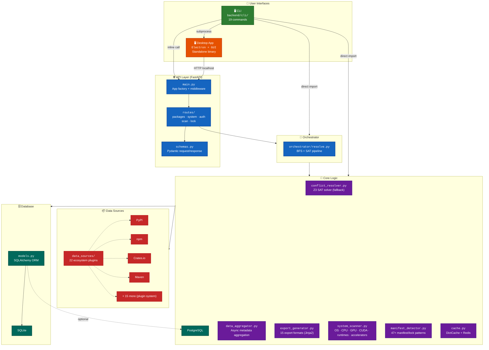
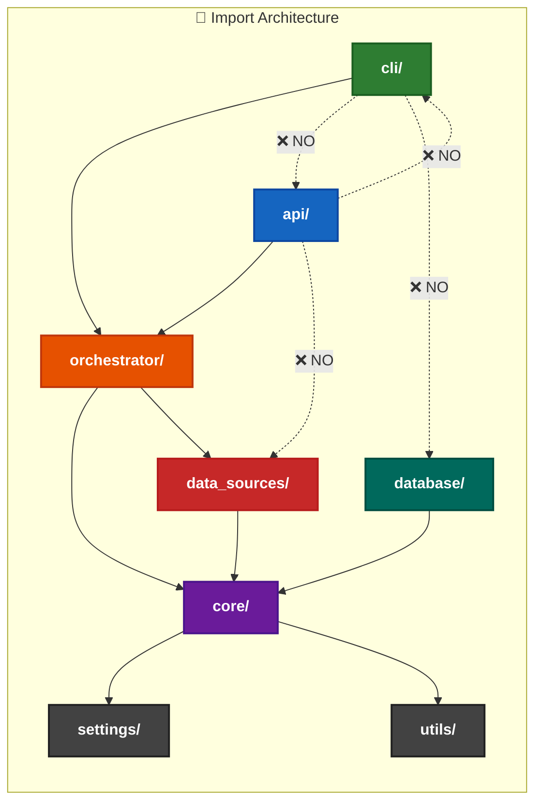
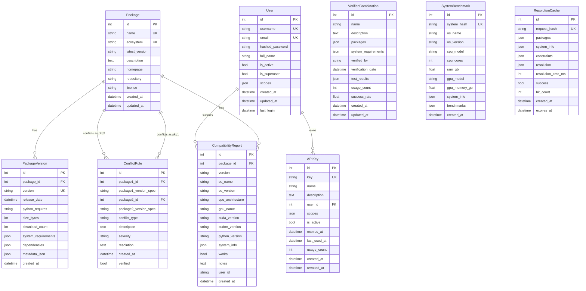

# Architecture



## Layer breakdown

### CLI layer (`backend/cli/`)

Modular CLI package with 22 files across 19 commands:

```
backend/cli/
├── __init__.py        # Re-exports all symbols for backward compat
├── main.py            # _build_parser(), main(), dispatch dict
├── shared.py          # 20+ shared helpers (parse, resolve, output, …)
└── commands/
    ├── serve.py       # cmd_serve — start API server
    ├── check.py       # cmd_check — system compatibility
    ├── resolve.py     # cmd_resolve — resolve package deps
    ├── info.py        # cmd_info — system overview
    ├── lock.py        # cmd_lock — manifest → lock file
    ├── graph.py       # cmd_graph — dependency tree
    ├── verify.py      # cmd_verify — validate lock file
    ├── scan.py        # cmd_scan — GitHub/local scan
    ├── update.py      # cmd_update — re-resolve single package
    ├── install.py     # cmd_install, cmd_restore — restore from lock
    ├── list_ecosystems.py  # cmd_list_ecosystems
    ├── auth.py        # cmd_auth — API key management
    ├── completion.py  # cmd_completion — shell completion
    ├── why.py         # cmd_why — explain version selection
    ├── outdated.py    # cmd_outdated — show outdated packages
    ├── diff.py        # cmd_diff — compare lock files
    ├── search.py      # cmd_search — search packages
    ├── sbom.py        # cmd_sbom — SBOM generation (SPDX/CycloneDX)
    └── details.py     # cmd_details — package details
```

The old monolithic `backend/cli.py` (2105 lines) was replaced by this package. A 3-line backward-compat shim remains at `backend/cli.py` for existing imports.

### API layer (`backend/api/`)

Entry point: `api/main.py` — creates the FastAPI app, registers middleware and routes.

- **Auth** (`api/auth.py`) — JWT + API key authentication. Only registered when `ENABLE_AUTH=true` (default).
- **Middleware** (`api/middleware.py`) — request ID, CORS, security headers, rate limiting, request size limits, correlation ID, response time.
- **Schemas** (`api/schemas.py`) — Pydantic request/response models.
- **Dependencies** (`api/dependencies.py`) — FastAPI dependency injection (database session, data aggregator, resolver, scanner).

Routes:

| Path prefix | File | Endpoints |
|---|---|---|
| `/api/v1/packages` | `packages.py` | Search, info, details, versions, dependencies, compatibility, resolve, export, export-formats, ecosystems |
| `/api/v1/system` | `system.py` | Info, check-compatibility |
| `/api/v1/auth` | `auth.py` | Register, login, logout, token, refresh, profile, api-keys, verify |
| `/api/v1/scan` | `scan.py` | GitHub repo, upload archive, local directory |
| `/api/v1` | `lock.py` | Verify, graph, update |

### Core logic (`backend/core/`)

- **`conflict_resolver.py`** — Z3 SAT solver (fallback). Lazy-loaded `z3` inside methods. SCC batch partitioning, dynamic version clustering, configurable optimization threshold.
- **`pubgrub_solver.py`** — PubGrub solver (default, Rust-backed `pubgrub-py` when installed; pure-Python fallback).
- **`hybrid_solver.py`** — Hybrid solver (PubGrub per-ecosystem + Z3 cross-ecosystem). Enabled via `USE_HYBRID_SOLVER=true`.
- **`plugin.py`** — Ecosystem plugin system: `EcosystemPlugin` ABC, `@register_ecosystem` decorator, `import_builtin_plugins()` for eager discovery. All 22 ecosystems use the plugin interface.
- **`data_aggregator.py`** — Aggregates package data from all ecosystem clients. Uses `asyncio.gather` for concurrent fetching with BFS batch parallelism and configurable `BFS_BATCH_SIZE`.
- **`orchestrator/resolve.py`** — BFS + SAT pipeline: `_group_by_ecosystem()` splits packages into per-ecosystem groups for **per-ecosystem solver isolation** (a conflict in npm can't block PyPI). Cross-ecosystem deps use a unified path. `create_solver()` factory selects PubGrub (default), Hybrid (`USE_HYBRID_SOLVER=true`), or Z3 fallback.
- **`export_generator.py`** — Jinja2 template-based export. 15 formats using `.j2` templates.
- **`system_scanner.py`** — Detects OS, CPU, GPU, CUDA, Python, Node.js, GCC, Java. Results cached with 5-min TTL.
- **`cache.py`** — `DictCache` (in-memory dict + TTL, no dependencies) with optional Redis fallback.
- **`manifest_detector.py`** — Scans project directories for 20+ manifest formats (requirements.txt, package.json, Cargo.toml, etc.)

### Data sources (`backend/data_sources/`)

All 22 ecosystem plugins (registered via `@register_ecosystem`), each an `EcosystemPlugin` subclass inheriting from `BaseClient`:

| Client | Ecosystem | Registry |
|---|---|---|
| `pypi_client.py` | PyPI | pypi.org |
| `npm_client.py` | npm | registry.npmjs.org |
| `conda_client.py` | Conda | repo.anaconda.com / conda-forge |
| `maven_client.py` | Maven | repo1.maven.org |
| `crates_client.py` | Crates.io | crates.io |
| `gomodules_client.py` | Go Modules | proxy.golang.org |
| `nuget_client.py` | NuGet | api.nuget.org |
| `rubygems_client.py` | RubyGems | rubygems.org |
| `packagist_client.py` | Packagist (PHP) | packagist.org |
| `homebrew_client.py` | Homebrew | formulae.brew.sh |
| `cocoapods_client.py` | CocoaPods | trunk.cocoapods.org |
| `apt_client.py` | APT (Debian) | deb.debian.org |
| `apk_client.py` | APK (Alpine) | dl-cdn.alpinelinux.org |
| `pub_client.py` | Pub (Dart/Flutter) | pub.dev |
| `gradle_client.py` | Gradle | plugins.gradle.org |
| `swift_client.py` | Swift | swiftpackageindex.com |
| `hex_client.py` | Hex (Elixir) | hex.pm |
| `haskell_client.py` | Haskell (Cabal) | hackage.haskell.org |
| `nix_plugin.py` | Nix | Nixpkgs / GitHub |
| `guix_plugin.py` | GNU Guix | Guix upstream |

All ecosystems use the **plugin system** (`backend/core/plugin.py`). Built-in plugins are eagerly discovered via `import_builtin_plugins()` — third-party plugins (installed via pip) are discoverable via setuptools entry points.

### Database (`backend/database/`)

- **`models.py`** — SQLAlchemy ORM models (8 tables, see ER diagram below). SQLite by default, PostgreSQL optional.
- **`compatibility_db.py`** — Compatibility matrix operations (CRUD for packages, reports, conflicts, benchmarks, cache).

## Import architecture rules

The codebase enforces strict import layering. Arrows show allowed dependency directions:



| Violation | Count | Status |
|---|---|---|
| `api/ → cli/` | 0 | **Fixed** — switched to `orchestrator/` |
| `cli/ → api/` | 0 | **Fixed** — `download_github_repo` moved to `core/utils.py` |
| `api/ → database/` | 7 | Should fix — needs data-access service layer |
| `data_sources/ → core/` | 50+ | **Accepted** — core utilities are natural dependency |
| `database/ → core/` | 6 | **Accepted** — DB uses version parsing from core |
| `cli/commands/serve.py → api/` | 1 | **Accepted** — serve wraps FastAPI app; deployment concern |
| `manifest_detector.py → core/` | 1 | **Accepted** — utility import |
| `backend/__init__.py → core/` | 4 | **Accepted** — public API re-exports |
| `cli.py → cli/` | 3 | **Accepted** — entry point shim |
| `run.py → api/` | 1 | **Accepted** — entry point |

## Key design decisions

- **Lazy loading**: `import z3` inside methods (not at module level), 22 ecosystem plugins via `@register_ecosystem` + `import_builtin_plugins()`. Saves ~1s on every CLI command that doesn't need resolution.
- **SQLite first**: No PostgreSQL or Redis required. SQLite + DictCache work for all standalone/desktop use cases.
- **Auth conditionally registered**: `ENABLE_AUTH=true` by default. Auth router only mounted when enabled.
- **Settings trimmed**: ~200 lines of core settings. Removed Celery, email, webhooks, monitoring, rate-limit-for-each-endpoint, and other server-only configs.
- **No Docker**: Tool ships as `pip install ud-resolver` and as a desktop app. Docker export templates (Dockerfile.j2, docker-compose.yml.j2) are user-facing features for exporting resolved dependencies.
- **Architecture rules enforced**: CI + pre-commit hooks verify no `api/ → cli/` or `cli/ → api/` imports. Coverage threshold `fail_under = 60` enforced in CI.

## Testing

```
tests/
├── unit/         → 2407 tests (CLI, API, core, data sources, settings, Hypothesis fuzz)
├── integration/  → 96 tests (API + DB + data flow, uses SQLite)
├── e2e/          → 74 tests (CLI black-box, problem-statement, JSON compliance)
│   conftest.py   → SQLite fallback, optional Redis
└── conftest.py   → shared fixtures
```

Integration tests default to SQLite (no PostgreSQL needed). Tests use `_patch_engine` to substitute the production database engine with the test engine.

## Data model (ER diagram)



**9 tables** across 4 domains:

| Domain | Tables | Purpose |
|---|---|---|
| 📦 **Package data** | `packages`, `package_versions` | Registry metadata for resolved packages |
| 🧪 **Compatibility** | `compatibility_reports`, `conflict_rules`, `verified_combinations` | Known-working combinations and conflicts |
| ⚡ **Infrastructure** | `system_benchmarks`, `resolution_cache` | Performance data and cached resolutions |
| 👤 **Auth** | `users`, `api_keys` | Authentication and API key management |
