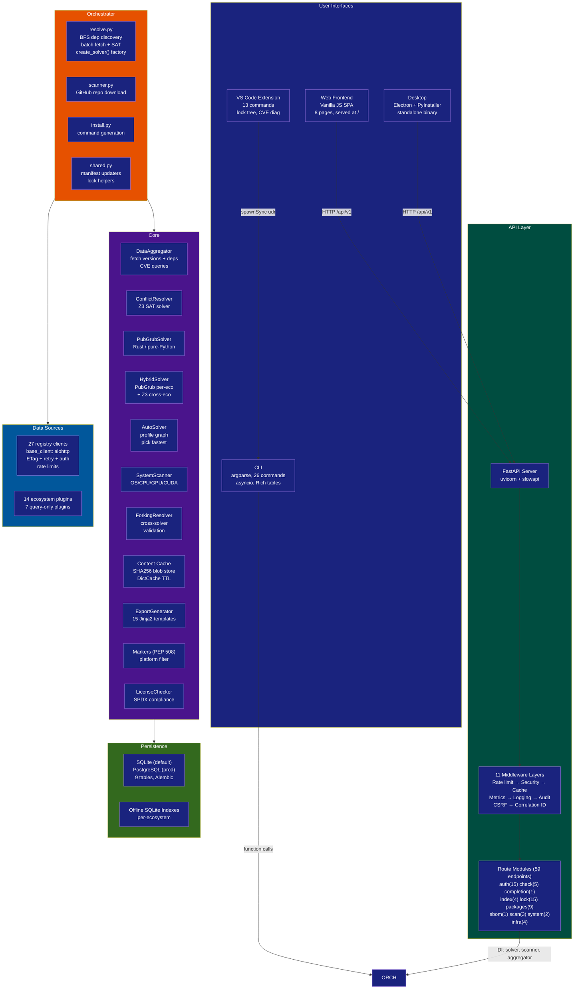
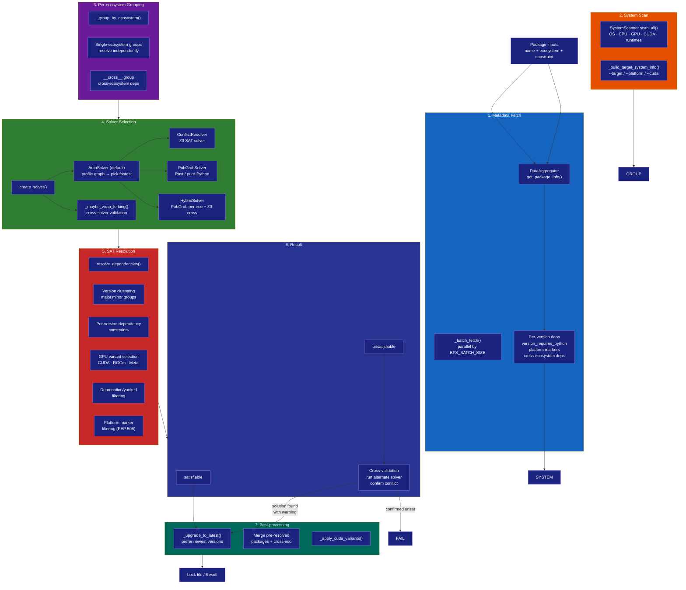
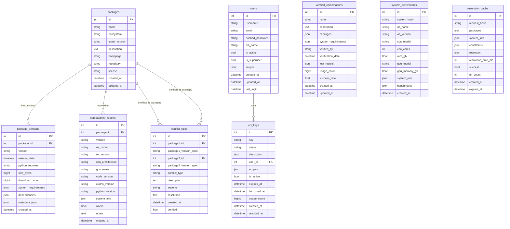

# Architecture

## Layer Diagram


```mermaid
flowchart TD
    subgraph UI["User Interfaces"]
        direction LR
        FE["Web Frontend<br/>Vanilla JS SPA<br/>8 pages, served at /"]
        VSC["VS Code Extension<br/>13 commands<br/>lock tree, CVE diag"]
        CLI["CLI<br/>argparse, 26 commands<br/>asyncio, Rich tables"]
        DESKTOP["Desktop<br/>Electron + PyInstaller<br/>standalone binary"]
    end

    FE -->|HTTP /api/v1| API
    VSC -->|spawnSync udr| CLI
    DESKTOP -->|HTTP /api/v1| API

    CLI -->|function calls| ORCH

    subgraph API_LAYER["API Layer"]
        API["FastAPI Server<br/>uvicorn + slowapi"]
        ROUTES["Route Modules (59 endpoints)<br/>auth(15) check(5) completion(1)<br/>index(4) lock(15) packages(9)<br/>sbom(1) scan(3) system(2)<br/>infra(4)"]
        MW["11 Middleware Layers<br/>Rate limit → Security → Cache<br/>Metrics → Logging → Audit<br/>CSRF → Correlation ID"]
    end

    API --> MW --> ROUTES
    ROUTES -->|DI: solver, scanner, aggregator| ORCH

    subgraph ORCH_LAYER["Orchestrator"]
        RESOLVE["resolve.py<br/>BFS dep discovery<br/>batch fetch + SAT<br/>create_solver() factory"]
        SCANNER["scanner.py<br/>GitHub repo download"]
        INSTALL["install.py<br/>command generation"]
        SHARED["shared.py<br/>manifest updaters<br/>lock helpers"]
    end

    ORCH_LAYER --> CORE_LAYER
    ORCH_LAYER --> DS

    subgraph CORE_LAYER["Core"]
        direction LR
        AGGR["DataAggregator<br/>fetch versions + deps<br/>CVE queries"]
        Z3["ConflictResolver<br/>Z3 SAT solver"]
        PG["PubGrubSolver<br/>Rust / pure-Python"]
        HS["HybridSolver<br/>PubGrub per-eco<br/>+ Z3 cross-eco"]
        AS["AutoSolver<br/>profile graph<br/>pick fastest"]
        SS["SystemScanner<br/>OS/CPU/GPU/CUDA"]
        FR["ForkingResolver<br/>cross-solver<br/>validation"]
        CACHE["Content Cache<br/>SHA256 blob store<br/>DictCache TTL"]
        EXPORT["ExportGenerator<br/>15 Jinja2 templates"]
        MARKERS["Markers (PEP 508)<br/>platform filter"]
        LICENSE["LicenseChecker<br/>SPDX compliance"]
    end

    subgraph DS["Data Sources"]
        CLIENTS["27 registry clients<br/>base_client: aiohttp<br/>ETag + retry + auth<br/>rate limits"]
        PLUGINS["14 ecosystem plugins<br/>7 query-only plugins"]
    end

    subgraph PERSISTENCE["Persistence"]
        SQLDB["SQLite (default)<br/>PostgreSQL (prod)<br/>9 tables, Alembic"]
        OFF["Offline SQLite Indexes<br/>per-ecosystem"]
    end

    CORE_LAYER --> PERSISTENCE

    style UI fill:#1a237e,color:#fff
    style API_LAYER fill:#004d40,color:#fff
    style ORCH_LAYER fill:#e65100,color:#fff
    style CORE_LAYER fill:#4a148c,color:#fff
    style DS fill:#01579b,color:#fff
    style PERSISTENCE fill:#33691e,color:#fff

    classDef box fill:#1a237e,color:#fff
    class FE,VSC,CLI,DESKTOP,API,ROUTES,MW,RESOLVE,SCANNER,INSTALL,SHARED,AGGR,Z3,PG,HS,AS,SS,FR,CACHE,EXPORT,MARKERS,LICENSE,CLIENTS,PLUGINS,SQLDB,OFF,ORCH box
```

---

## Import Architecture Rules

```
orchestrator/ → core/, data_sources/  (no cli, no api)
cli/          → orchestrator/, core/ (no api)
api/          → orchestrator/, core/ (no cli)
core/         → zero knowledge of cli, api, desktop
Desktop       → HTTP only (zero Python imports)
Web Frontend  → HTTP only (served as static files, no build step)
VS Code Ext   → CLI exec only (spawnSync, no API/Python imports)
```

| Layer | Count | Verdict |
|---|---|---|
| `api/ → cli/` | 0 | Clean |
| `cli/ → api/` | 0 | Clean |
| `api/ → database/` | 7 | Should fix — needs data-access service layer |
| `data_sources/ → core/` | 50+ | Accepted — core utilities are natural dependency |
| `database/ → core/` | 6 | Accepted — DB uses version parsing from core |
| `cli/commands/serve.py → api/` | 1 | Accepted — serve wraps FastAPI app |
| `manifest_detector.py → core/` | 1 | Accepted — utility import |
| `backend/__init__.py → core/` | 4 | Accepted — public API re-exports |
| `cli.py → cli/` | 3 | Accepted — entry point shim |
| `run.py → api/` | 1 | Accepted — entry point |

---

## Solver Pipeline


```mermaid
flowchart TD
    INPUT["Package inputs<br/>name + ecosystem + constraint"] --> AGG

    subgraph FETCH["1. Metadata Fetch"]
        AGG["DataAggregator<br/>get_package_info()"]
        BATCH["_batch_fetch()<br/>parallel by BFS_BATCH_SIZE"]
        DEPS["Per-version deps<br/>version_requires_python<br/>platform markers<br/>cross-ecosystem deps"]
    end

    INPUT --> AGG
    AGG --> DEPS

    DEPS --> SYSTEM

    subgraph SYSTEM_SCAN["2. System Scan"]
        SYNC["SystemScanner.scan_all()<br/>OS · CPU · GPU · CUDA · runtimes"]
        TARGET["_build_target_system_info()<br/>--target / --platform / --cuda"]
    end

    SYSTEM_SCAN --> GROUP

    subgraph GROUPING["3. Per-ecosystem Grouping"]
        GRP["_group_by_ecosystem()"]
        ECO["Single-ecosystem groups<br/>resolve independently"]
        CROSS["__cross__ group<br/>cross-ecosystem deps"]
    end

    GROUPING --> FACTORY

    subgraph FACTORY["4. Solver Selection"]
        CS["create_solver()"]
        AUTO["AutoSolver (default)<br/>profile graph → pick fastest"]
        Z3P["ConflictResolver<br/>Z3 SAT solver"]
        PGP["PubGrubSolver<br/>Rust / pure-Python"]
        HYBRID["HybridSolver<br/>PubGrub per-eco + Z3 cross"]
        WRAP["_maybe_wrap_forking()<br/>cross-solver validation"]
    end

    CS --> AUTO
    AUTO --> Z3P
    AUTO --> PGP
    AUTO --> HYBRID
    CS --> WRAP

    FACTORY --> SOLVE

    subgraph SOLVE["5. SAT Resolution"]
        SC["resolve_dependencies()"]
        VC["Version clustering<br/>major.minor groups"]
        PV["Per-version dependency<br/>constraints"]
        CUDA["GPU variant selection<br/>CUDA · ROCm · Metal"]
        DEP["Deprecation/yanked<br/>filtering"]
        MARKER["Platform marker<br/>filtering (PEP 508)"]
    end

    SOLVE --> OUTCOME

    subgraph OUTCOME["6. Result"]
        SAT["satisfiable"]
        UNSAT["unsatisfiable"]
        CV["Cross-validation<br/>run alternate solver<br/>confirm conflict"]
    end

    SAT --> UPGRADE
    UNSAT --> CV
    CV -->|solution found<br/>with warning| UPGRADE
    CV -->|confirmed unsat| FAIL

    subgraph POST["7. Post-processing"]
        UPGRADE["_upgrade_to_latest()<br/>prefer newest versions"]
        MERGE["Merge pre-resolved<br/>packages + cross-eco"]
        CVD["_apply_cuda_variants()"]
    end

    POST --> LOCK

    LOCK["Lock file / Result"]

    style FETCH fill:#1565c0,color:#fff
    style SYSTEM_SCAN fill:#e65100,color:#fff
    style GROUPING fill:#6a1b9a,color:#fff
    style FACTORY fill:#2e7d32,color:#fff
    style SOLVE fill:#c62828,color:#fff
    style OUTCOME fill:#283593,color:#fff
    style POST fill:#00695c,color:#fff

    classDef box fill:#1a237e,color:#fff
    class INPUT,AGG,BATCH,DEPS,SYNC,TARGET,GRP,ECO,CROSS,CS,AUTO,Z3P,PGP,HYBRID,WRAP,SC,VC,PV,CUDA,DEP,MARKER,SAT,UNSAT,CV,UPGRADE,MERGE,CVD,LOCK,SYSTEM,GROUP,FAIL box
```

---

## Key Design Decisions

| Decision | Rationale |
|---|---|
| **Z3 as primary solver** | CDCL SAT solver handles complex cross-ecosystem conflict graphs. PubGrub available as opt-in via `USE_PUBGRUB_SOLVER=true`. |
| **Async-first** | All network I/O is async via aiohttp/httpx. CLI uses `asyncio.run()` for sync-appearing interface. |
| **SQLite-first persistence** | Zero-config for local use. Optional PostgreSQL for production with Alembic migrations. |
| **Offline indexes** | Pre-built SQLite indexes can be downloaded for environments without registry access. |
| **Content-addressed cache** | SHA256-verified blob store in `~/.cache/udr/cac/`. Every read verifies integrity. |
| **Lazy env var evaluation** | All `os.environ.get()` calls in settings use PEP 562 `__getattr__` — read at access time, not import time. |
| **Conditional auth mounting** | Auth routes only added to router when `ENABLE_AUTH=true`. Prevents auth endpoints from being reachable in local mode. |
| **Lock file as JSON** | `udr.lock` is plain JSON (version 2.1). No binary format, grep-friendly, diffable in PRs. |
| **Atomic writes** | All file writes use temp-file + `os.rename()` pattern with fcntl locking for crash safety. |

---

## Database Schema (9 tables)


```mermaid
erDiagram
    packages ||--o{ package_versions : "has versions"
    packages ||--o{ compatibility_reports : "reported on"
    packages ||--o{ conflict_rules : "conflicts as package1"
    packages ||--o{ conflict_rules : "conflicts as package2"
    users ||--o{ api_keys : "owns"

    packages {
        int id PK
        string name
        string ecosystem
        string latest_version
        text description
        string homepage
        string repository
        string license
        datetime created_at
        datetime updated_at
    }

    package_versions {
        int id PK
        int package_id FK
        string version
        datetime release_date
        string python_requires
        bigint size_bytes
        bigint download_count
        json system_requirements
        json dependencies
        json metadata_json
        datetime created_at
    }

    compatibility_reports {
        int id PK
        int package_id FK
        string version
        string os_name
        string os_version
        string cpu_architecture
        string gpu_name
        string cuda_version
        string cudnn_version
        string python_version
        json system_info
        bool works
        text notes
        datetime created_at
    }

    conflict_rules {
        int id PK
        int package1_id FK
        string package1_version_spec
        int package2_id FK
        string package2_version_spec
        string conflict_type
        text description
        string severity
        text resolution
        datetime created_at
        bool verified
    }

    verified_combinations {
        int id PK
        string name
        text description
        json packages
        json system_requirements
        string verified_by
        datetime verification_date
        json test_results
        bigint usage_count
        float success_rate
        datetime created_at
        datetime updated_at
    }

    system_benchmarks {
        int id PK
        string system_hash
        string os_name
        string os_version
        string cpu_model
        int cpu_cores
        float ram_gb
        string gpu_model
        float gpu_memory_gb
        json system_info
        json benchmarks
        datetime created_at
    }

    resolution_cache {
        int id PK
        string request_hash
        json packages
        json system_info
        json constraints
        json resolution
        int resolution_time_ms
        bool success
        int hit_count
        datetime created_at
        datetime expires_at
    }

    users {
        int id PK
        string username
        string email
        string hashed_password
        string full_name
        bool is_active
        bool is_superuser
        json scopes
        datetime created_at
        datetime updated_at
        datetime last_login
    }

    api_keys {
        int id PK
        string key
        string name
        text description
        int user_id FK
        json scopes
        bool is_active
        datetime expires_at
        datetime last_used_at
        bigint usage_count
        datetime created_at
        datetime revoked_at
    }
```
