# CLI Reference

## Entry Point

```
udr <command> [options]
```

Installed by `pip install ud-resolver` as the `udr` console script (entry point: `backend.cli.main:main`).

All commands support `--help` for inline usage and common flags `--version`, `--offline`.

### Command Dispatch Flow

```mermaid
flowchart LR
    subgraph INVOCATION["Invocation"]
        ARGS["udr &lt;command&gt; [args]"]
        PARSER["_build_parser()<br/>argparse with 24 subparsers"]
    end

    subgraph DISPATCH["Dispatch"]
        MAIN["main()"]
        DT["dispatch table<br/>cmd name → handler function"]
    end

    subgraph HANDLER["Command Handler"]
        HAND["cmd_*() in commands/*.py"]
        CORO["async def inner coroutine"]
        RUN["asyncio.run(inner())"]
    end

    subgraph ORCH["Orchestrator"]
        ORCH_LAYER["orchestrator/resolve.py<br/>create_solver() + BFS"]
        AGG["core/data_aggregator.py"]
        SOLVER["ConflictResolver / PubGrubSolver"]
        SS["core/system_scanner.py"]
        EXPORT["core/export_generator.py"]
    end

    ARGS -->|parse_args| PARSER
    PARSER -->|args Namespace| MAIN
    MAIN -->|args.command| DT
    DT -->|function call| HAND
    HAND -->|async workflow| CORO
    CORO --> RUN
    RUN --> ORCH_LAYER
    ORCH_LAYER --> AGG
    ORCH_LAYER --> SOLVER
    ORCH_LAYER --> SS
    HAND --> EXPORT

    style INVOCATION fill:#1a237e,color:#fff
    style DISPATCH fill:#004d40,color:#fff
    style HANDLER fill:#e65100,color:#fff
    style ORCH fill:#4a148c,color:#fff
```



---

## Global Flags

| Flag | Description |
|---|---|
| `--version` | Print version and exit |
| `--offline` | Offline mode: use SQLite offline indexes + cached data; no network requests |

---

## Exit Code Summary

| Code | Meaning |
|---|---|
| `0` | Success |
| `1` | Error (resolution failure, file not found, invalid input, etc.) |
| `130` | Cancelled by user (Ctrl+C) |

---

## `auth`

Manage API keys for the UDR server in saas mode, and Ed25519 signing keys for lock file signing.

**Requires:** Running UDR server with `ENABLE_AUTH=true` for API-key subcommands.

### `auth create`

Generate a new API key.

```
udr auth create --name my-key --role admin
udr auth create --name ci-token --role read-only --description "Used in GitHub Actions"
```

| Flag | Default | Description |
|---|---|---|
| `--name` | `cli-generated` | Human-readable name for the key (3-100 chars) |
| `--role` | `read-only` | `read-only`, `read-write`, or `admin` |
| `--description` | — | Optional description |

### `auth revoke`

Revoke an API key by ID.

```
udr auth revoke 1
```

| Argument | Description |
|---|---|
| `key_id` | ID of the key to revoke (required, positional integer) |

### `auth list`

List all API keys with ID, name, role, active status, last used, and usage count.

```
udr auth list
```

### `auth gen-key`

Generate an Ed25519 signing key pair for lock file signing. Stored at `~/.config/udr/signing.key`.

```
udr auth gen-key
```

### `auth show-key`

Display the current Ed25519 public signing key.

```
udr auth show-key
```

**Exit codes:** 0 on success, 1 on failure.

---

## `check`

Scan the current system and display a compatibility report. Can also check lock files for CVEs, license compliance, deprecated packages, peer dependency issues, or policy compliance.

**Usage:**

```bash
udr check                              # basic system info table
udr check -v                           # verbose (CPU arch, all runtimes)
udr check --deps                       # also show project's core deps
udr check --json                       # raw JSON output, then exit
udr check --cuda 12.1                  # simulate for specific CUDA version
udr check --device rocm                # simulate for AMD ROCm device
udr check --cve                        # check lock file for known CVEs
udr check --license                    # check lock file for license compliance
udr check --deprecated                 # check lock file for deprecated/yanked packages
udr check --peer                       # check lock file for peer dependency issues
udr check --policy                     # check policy compliance (udr-policy.yaml)
```

| Flag | Default | Description |
|---|---|---|
| `-v, --verbose` | `False` | Show CPU architecture, runtime versions table |
| `--deps` | `False` | Show project core dependencies (from `pyproject.toml`) |
| `--json` | `False` | Output as JSON to stdout, then exit |
| `--cuda` | `None` | Target CUDA version string (e.g. `12.1`, `11.8`) — selects `+cu<ver>` package variants when available, and restricts pytorch-family packages to base versions shipped on the matching pytorch index tag (e.g. cu121 → torch ≤ 2.5.1); otherwise the request is informational (CUDA encoded in nvidia dep names) |
| `--device` | `None` | Target compute device: `cpu`, `cuda`, `mps`, `rocm` |
| `--cve` | `False` | Check lock file packages against OSV vulnerability database |
| `--license` | `False` | Check lock file for license compliance |
| `--deprecated` | `False` | Check lock file for deprecated or yanked packages |
| `--peer` | `False` | Check lock file for peer dependency issues |
| `--policy`, `-p` | `None` | Path to policy YAML file (default: `./udr-policy.yaml`) |
| `-d, --directory` | `.` | Project directory with lock file |
| `--workspace` | `None` | Workspace name — lock file becomes `udr-{workspace}.lock` |
| `-l, --lock-file` | `None` | Explicit lock file path (overrides directory/workspace) |

**Exit codes:** 0 on success, 1 on failure or policy violation.

---

## `completion`

Generate shell completion scripts for bash, zsh, or fish.

```
udr completion                    # auto-detect shell (requires shellingham)
udr completion bash               # bash completions
udr completion zsh                # zsh completions
udr completion fish               # fish completions
```

**Installing completions:**

```bash
# bash — source in ~/.bashrc
udr completion bash > /etc/bash_completion.d/udr

# zsh — save to a directory in $fpath
udr completion zsh > /usr/local/share/zsh/site-functions/_udr

# fish
udr completion fish > ~/.config/fish/completions/udr.fish
```

| Argument | Default | Description |
|---|---|---|
| `shell` | `auto` | Shell to target: `bash`, `zsh`, `fish` (auto-detected via shellingham if omitted) |

**Exit codes:** 0 on success, 1 on unsupported shell.

---

## `details`

Show detailed package information — description, latest version, total version count, dependencies.

```
udr details numpy                       # PyPI (default ecosystem)
udr details react -e npm                # npm ecosystem
udr details serde -e crates --json      # JSON output
```

| Flag | Default | Description |
|---|---|---|
| `package` | (required) | Package name |
| `-e, --ecosystem` | `pypi` | Ecosystem identifier |
| `--json` | `False` | Output as JSON |

**Exit codes:** 0 on success, 1 on not found or fetch failure.

---

## `diff`

Compare two lock files and show version differences (added, removed, changed, unchanged).

```
udr diff old.lock new.lock             # compare two explicit lock files
udr diff old.lock new.lock --json      # JSON output
udr diff --workspace backend           # compare udr.lock vs udr-backend.lock
```

| Argument/Flag | Default | Description |
|---|---|---|
| `lock_file_a` | `None` | First lock file path (positional, optional with `--workspace`) |
| `lock_file_b` | `None` | Second lock file path (positional, optional with `--workspace`) |
| `--json` | `False` | Output as JSON |
| `-d, --directory` | `.` | Project directory containing lock files |
| `--workspace` | `None` | Compare base lock vs `udr-{workspace}.lock` |

**Exit codes:** 0 on success, 1 on read error.

---

## `export`

Export a lock file to a specific format.

```
udr export                                          # default: requirements.txt
udr export --format requirements.txt                # pip freeze style
udr export --format Dockerfile                      # Dockerfile with pip install
udr export --output /tmp/deps.txt                   # write to file
udr export --workspace backend                      # export from workspace lock
udr export -l /path/to/lock.json                    # explicit lock file
```

| Flag | Default | Description |
|---|---|---|
| `-d, --directory` | `.` | Project directory with lock file |
| `--workspace` | `None` | Workspace name — lock file becomes `udr-{workspace}.lock` |
| `-l, --lock-file` | `None` | Explicit lock file path |
| `-f, --format` | `requirements.txt` | Export format identifier |
| `-o, --output` | `None` | Output file path (default: print to stdout) |

**Exit codes:** 0 on success, 1 on failure.

---

## `graph`

Display a dependency tree for one or more packages, showing direct and transitive dependencies.

```
udr graph flask django                        # PyPI packages
udr graph numpy@pypi serde@crates             # mixed ecosystems
udr graph react -e npm                        # npm packages
udr graph torch --cuda 12.1                   # with CUDA variant selection (if published)
udr graph torch --json                        # JSON output
```

| Flag | Default | Description |
|---|---|---|
| `packages` | (required) | One or more package names with optional `@ecosystem` suffix |
| `-e, --ecosystem` | `pypi` | Default ecosystem for packages without `@ecosystem` suffix |
| `--json` | `False` | Output as JSON |
| `--cuda` | `None` | Target CUDA version (e.g. `12.1`) — auto-detected if omitted. Selects a `+cu<ver>` variant when the package publishes one (e.g. pytorch's own index). For PyPI `torch`, the CUDA build is chosen by consulting the pytorch wheel index: the resolver caps torch to the version ceiling of the requested tag and rewrites it to its `+cu<ver>` local version (e.g. `--cuda 12.1` → `2.5.1+cu121`) |
| `--device` | `None` | Target compute device: `cpu`, `cuda`, `mps`, `rocm` |

**Exit codes:** 0 on success, 1 on resolution failure.

---

## `index`

Manage offline SQLite indexes for local package resolution. Indexes stored at `~/.cache/udr/indexes/{ecosystem}.db`.

### `index pull`

Download pre-built SQLite indexes from a remote URL.

```
udr index pull https://indexes.udr.dev                # pull all available indexes
udr index pull https://indexes.udr.dev -e pypi        # single ecosystem
```

| Flag | Default | Description |
|---|---|---|
| `url` | (required) | Base URL for index download (expects `index.json` + `{eco}.db` files) |
| `-e, --ecosystem` | `None` | Only pull index for this ecosystem |

### `index build`

Build an offline SQLite index from resolved packages in `udr.lock` or a comma-separated package list.

```
udr index build                             # build from udr.lock in cwd
udr index build -d /path/to/project          # build from lock file in project
udr index build --packages flask,requests    # build index for specific packages
udr index build --packages react -e npm      # build index for npm packages
```

| Flag | Default | Description |
|---|---|---|
| `--packages` | `""` | Comma-separated package names to index (uses `--ecosystem`) |
| `-e, --ecosystem` | `pypi` | Ecosystem for `--packages` |
| `-d, --directory` | cwd | Directory containing `udr.lock` |

### `index status`

Show which ecosystems have local indexes available, with package and version counts.

```
udr index status                            # rich table output
udr index status --json                     # JSON output
```

| Flag | Default | Description |
|---|---|---|
| `--json` | `False` | Output as JSON |

### `index sync`

Sync local indexes from remote registries.

```
udr index sync --all                        # sync all ecosystems
udr index sync -e pypi                      # sync single ecosystem
```

| Flag | Default | Description |
|---|---|---|
| `-e, --ecosystem` | `None` | Ecosystem to sync |
| `-a, --all` | `False` | Sync all supported ecosystems |

**Exit codes:** 0 on success, 1 on failure.

---

## `init`

Initialize a new project with UDR configuration files.

```
udr init                                        # auto-detect project type
udr init -t python-requirements                 # Python requirements project
udr init -t python-pyproject                    # Python pyproject.toml project
udr init -t node                                # Node.js project
udr init -t go                                  # Go project
udr init -t rust                                # Rust project
udr init --with-config                          # also create udr.json config
udr init --gitignore                            # also create .gitignore
udr init --lock                                 # run initial lock after init
```

| Flag | Default | Description |
|---|---|---|
| `-t, --template` | `auto` | Project template: `python-requirements`, `python-pyproject`, `node`, `go`, `rust` |
| `-n, --name` | `None` | Project name (defaults to directory name) |
| `-d, --directory` | `.` | Project directory |
| `-f, --force` | `False` | Overwrite existing files |
| `--with-config` | `False` | Create `udr.json` configuration file |
| `--gitignore` | `False` | Create `.gitignore` with UDR entries |
| `--lock` | `False` | Run initial resolution after initialization |

**Exit codes:** 0 on success, 1 on failure.

---

## `install`

Install **direct** dependencies from the lock file using their native package managers.

```
udr install                              # install all direct deps
udr install -d /path/to/project          # specific project directory
udr install --lock-file path/to/lock.json  # custom lock file path
udr install --workspace backend           # install from udr-backend.lock
udr install -e npm                       # only install npm packages
udr install --dry-run                    # show install commands without executing
udr install -y                           # skip confirmation prompt
udr install --production                 # skip dev dependencies
udr install --restore                    # restore mode (all direct + transitive deps)
```

| Flag | Default | Description |
|---|---|---|
| `-d, --directory` | `.` | Project directory containing lock file |
| `-l, --lock-file` | `None` | Path to lock file |
| `--workspace` | `None` | Workspace name — lock file becomes `udr-{workspace}.lock` |
| `-e, --ecosystem` | `None` | Only install packages from this ecosystem; all ecosystems if omitted |
| `-n, --dry-run` | `False` | Show install commands without executing them |
| `-y, --yes` | `False` | Skip confirmation prompt |
| `--restore` | `False` | Restore mode — install all packages (direct + transitive) |
| `--production` | `False` | Skip dev dependencies |
| `--cuda` | `None` | CUDA version to target (e.g. `12.1`) |
| `--target` | `None` | Target OS: `linux`, `windows`, `darwin` |
| `--platform` | `None` | Target CPU arch: `x86_64`, `aarch64`, `arm64`, `i386`, `amd64` |

**Ecosystem installers used:**

| Ecosystem | Command |
|---|---|
| `pypi` | `pip install pkg==ver` |
| `npm` | `npm install pkg@ver` |
| `crates` | `cargo add pkg@ver` |
| `gomodules` | `go get pkg@ver` |
| `conda` | `conda install pkg==ver` |
| `rubygems` | `gem install pkg==ver` |
| `packagist` | `composer require pkg==ver` |
| `pub` | `dart pub add pkg:ver` |
| `nuget` | `dotnet add package pkg --version ver` |
| `cocoapods` | `pod install` (uses Podfile) |
| `maven` | `mvn dependency:copy-dependencies` |
| `homebrew` | `brew install pkg` |
| `hex` | `mix deps.update pkg` |
| `swift` | `swift package resolve` |

**Exit codes:** 0 on success, 1 on failure.

---

## `list-ecosystems`

List all supported package ecosystems with display names and capabilities.

```
udr list-ecosystems                     # rich table output
udr list-ecosystems --json              # JSON array output
```

| Flag | Default | Description |
|---|---|---|
| `--json` | `False` | Output as JSON array |

**Exit codes:** 0 always.

---

## `lock`

Auto-detect dependency manifests in a project directory, fetch metadata for all packages, scan the system, run SAT resolution, and write a `udr.lock` file.

**Usage:**

```bash
udr lock                                     # current directory
udr lock -d /path/to/project                 # specific project
udr lock -m requirements.txt                 # only process one manifest
udr lock --dry-run                           # preview without writing
udr lock -y                                  # skip confirmation prompts
udr lock -i                                  # interactive manifest selection
udr lock --json                              # output lock data as JSON to stdout
udr lock -r                                  # write readable report file
udr lock --cuda 12.1                         # target CUDA 12.1 (variant-aware)
udr lock --target linux --platform x86_64    # cross-compilation for linux/amd64
udr lock --sign                              # sign lock file with Ed25519 key
udr lock --provenance                        # add SLSA provenance section
udr lock --check                             # CI drift detection (exit 1 if out of date)
udr lock --auto-sync                         # auto-sync stale local indexes
udr lock --export Dockerfile                 # also export resolved deps
```

**Flags:**

| Flag | Default | Description |
|---|---|---|
| `-d, --directory` | `.` | Project root directory to scan |
| `-m, --manifest` | `None` | Only process a specific manifest file; all manifests if omitted |
| `--export` | `None` | Export resolved deps to a format (e.g. `Dockerfile`, `requirements.txt`) |
| `-y, --yes` | `False` | Update manifests in-place without prompting |
| `--dry-run` | `False` | Run resolution and show results but don't write any files |
| `-i, --interactive` | `False` | Select manifests manually + resolve conflicts interactively |
| `--cuda` | `None` | Target CUDA version (e.g. `12.1`, `11.8`) — selects `+cu<ver>` package variants when the registry publishes them, and caps pytorch-family packages (torch/torchvision/torchaudio/triton) to the base versions shipped on the matching pytorch index tag |
| `--device` | `None` | Target compute device: `cpu`, `cuda`, `mps`, `rocm`. Note: `--device cpu` requests a CPU-only graph — but PyPI `torch` (2.x+) ships a single combined wheel whose metadata hard-requires `nvidia-*-cuXX` deps, so those still appear unless a CPU-only index is configured (e.g. `download.pytorch.org/whl/cpu`) |
| `--json` | `False` | Output lock data as JSON to stdout instead of writing file |
| `-r, --report` | `False` | Write readable report file (`udr.report.txt`) alongside lock file |
| `--include-dev` | `False` | Include manifests from examples, test, docs directories |
| `--timeout` | `None` | Resolution timeout in seconds (default: 120 from `SOLVER_TIMEOUT`) |
| `--extras` | `None` | Comma-separated extras groups to activate (e.g. `dotenv,speedups`) |
| `--pin` | `None` | Pin a package to an exact version (`name==version`). Repeatable. |
| `--pin-mode` | `none` | Global pinning strategy: `none`, `patch`, `minor`, `exact` |
| `--block` | `None` | Block a package from resolution. Repeatable. |
| `--freeze` | `False` | Freeze all packages at their lock-file versions |
| `--workspace` | `None` | Workspace name for monorepo support — lock file becomes `udr-{workspace}.lock` |
| `--prefix` | `None` | Prefix package names in lock file (e.g. `backend/` for monorepo scoping) |
| `--force`, `-f` | `False` | Force full re-resolution, ignoring existing lock file cache |
| `--target` | `None` | Target OS for cross-compilation: `linux`, `windows`, `darwin` |
| `--platform` | `None` | Target CPU architecture: `x86_64`, `aarch64`, `arm64`, `i386`, `amd64` |
| `--auto-sync` | `False` | Auto-sync stale local indexes before resolution |
| `--sign` | `False` | Sign the lock file with Ed25519 key |
| `--provenance` | `False` | Add SLSA provenance section to lock file |
| `--check`, `-c` | `False` | CI mode: run resolution and diff against existing lock; exit 1 on drift |
| `--with-dev` | `False` | Include dev/optional dependency manifests |
| `--without-optional` | `False` | Exclude optional dependencies |

**Pipeline steps:**

1. **Detect manifests** — scan directory for recognized dependency files
2. **Parse packages** — extract name, ecosystem, constraint from each manifest
3. **Fetch metadata** — query registry APIs for versions, dependencies, system requirements
4. **Scan system** — detect OS, CPU, GPU, CUDA, Python, runtimes
5. **Resolve** — SAT solver finds compatible versions across all packages and ecosystems
6. **Lock** — write `udr.lock`
7. **Report/export** — optional report file and export generation
8. **Sign/provenance** — optional Ed25519 signing and SLSA metadata
9. **Update manifests** — optionally pin resolved versions in original manifest files

**Lock file structure (`udr.lock`):**

```json
{
  "version": "2.1",
  "generated_at": "2026-07-05T12:00:00",
  "resolver": "sat",
  "system": {
    "os": "Linux 6.2.0",
    "python": "3.11.5",
    "cpu": "Intel(R) Xeon(R)",
    "gpu": "NVIDIA A100",
    "cuda": "12.1"
  },
  "manifests": ["requirements.txt"],
  "packages": {
    "torch": {
      "name": "torch",
      "ecosystem": "pypi",
      "resolved_version": "2.1.2+cu121",
      "direct": true,
      "cuda_variant": true,
      "cuda_version": "121",
      "original_constraint": ">=2.0",
      "source": "requirements.txt",
      "resolution_hash": "abc123def456",
      "deprecated": false,
      "yanked": false,
      "integrity": "sha256-47DEQpj8HBSa+/TImW+5JCeuQeRkm5NMpJWZG3hSuFU=",
      "depends_on": {
        "pypi": {
          "sympy": ">=1.0",
          "jinja2": ">=2.0"
        }
      }
    }
  },
  "warnings": []
}
```

**Recognized manifests and lock files:**

| File | Ecosystem | Type |
|---|---|---|
| `requirements.txt`, `requirements.in`, `*-requirements.txt` | pypi | Manifest |
| `Pipfile` | pypi | Manifest |
| `pyproject.toml` | pypi | Manifest |
| `Pipfile.lock` | pypi | Lock |
| `poetry.lock` | pypi | Lock |
| `uv.lock` | pypi | Lock |
| `package.json` | npm | Manifest |
| `package-lock.json` | npm | Lock |
| `yarn.lock` | npm | Lock |
| `pnpm-lock.yaml` | npm | Lock |
| `Cargo.toml` | crates | Manifest |
| `Cargo.lock` | crates | Lock |
| `go.mod` | gomodules | Manifest |
| `go.sum` | gomodules | Lock (version source) |
| `environment.yml`, `environment.yaml` | conda | Manifest |
| `Gemfile` | rubygems | Manifest |
| `Gemfile.lock` | rubygems | Lock |
| `composer.json` | packagist | Manifest |
| `composer.lock` | packagist | Lock |
| `pubspec.yaml` | pub | Manifest |
| `build.gradle`, `build.gradle.kts` | gradle | Manifest |
| `Package.swift` | swift | Manifest |
| `Package.resolved` | swift | Lock |
| `mix.exs` | hex | Manifest |
| `mix.lock` | hex | Lock |
| `*.cabal`, `cabal.project`, `stack.yaml` | haskell | Manifest |
| `pom.xml` | maven | Manifest |
| `Podfile`, `Podfile.lock` | cocoapods | Manifest |
| `packages.config` | nuget | Manifest |
| `Brewfile`, `Brewfile.lock.json` | homebrew | Manifest |
| `apt-packages.txt` | apt | Manifest |
| `apk-packages.txt` | apk | Manifest |
| `default.nix`, `shell.nix`, `flake.nix`, `flake.lock` | nix | Manifest |
| `guix.scm`, `manifest.scm` | guix | Manifest |
| `udr.lock` | — | Self (UDR lock file) |

**Exit codes:** 0 on success, 1 on failure, 130 on user cancel.

---

## `migrate`

Migrate existing lock files to `udr.lock`. Supports 25 source lock file formats.

**Supported source formats:** `package-lock.json`, `Cargo.lock`, `poetry.lock`, `uv.lock`, `go.sum`, `Gemfile.lock`, `composer.lock`, `mix.lock`, `Package.resolved`, `yarn.lock`, `pnpm-lock.yaml`, `Brewfile.lock.json`, `Podfile.lock`, `Pipfile.lock`.

```
udr migrate                                     # auto-detect and migrate
udr migrate --display                           # preview only (no write)
udr migrate --force                             # overwrite existing udr.lock
udr migrate -d /path/to/project                 # specific project
udr migrate -e pypi                             # override detected ecosystem
```

| Flag | Default | Description |
|---|---|---|
| `-d, --directory` | `.` | Project directory |
| `-e, --ecosystem` | `None` | Override detected ecosystem for all packages |
| `-f, --force` | `False` | Overwrite existing `udr.lock` |
| `-y, --yes` | `False` | Skip confirmation prompt |
| `--display` | `False` | Preview only — don't write lock file |

**Exit codes:** 0 on success, 1 on failure.

---

## `outdated`

List packages with newer versions available in their respective registries.

```
udr outdated                           # check all packages in current project
udr outdated -d /path/to/project       # specific project
udr outdated --json                    # JSON output
udr outdated -e npm                    # only check npm packages
udr outdated --workspace backend       # check udr-backend.lock
udr outdated -l /path/to/lock.json     # explicit lock file
```

| Flag | Default | Description |
|---|---|---|
| `-d, --directory` | `.` | Project directory with lock file |
| `--json` | `False` | Output as JSON |
| `-e, --ecosystem` | `None` | Only check packages from this ecosystem; all ecosystems if omitted |
| `--workspace` | `None` | Workspace name — lock file becomes `udr-{workspace}.lock` |
| `-l, --lock-file` | `None` | Explicit lock file path |

**Exit codes:** 0 on success, 1 on error.

---

## `resolve`

Resolve compatible versions for one or more packages from any ecosystem.

```
udr resolve numpy pandas scikit-learn           # PyPI (default ecosystem)
udr resolve react vue -e npm                     # npm ecosystem
udr resolve serde tokio -e crates                # Cargo ecosystem
udr resolve flask django --format json           # JSON output
udr resolve torch --interactive                  # manual conflict resolution
udr resolve numpy@pypi express@npm               # mixed ecosystems
```

| Flag | Default | Description |
|---|---|---|
| `packages` | (required) | One or more package names. Use `pkg@eco` syntax for non-default ecosystems |
| `-e, --ecosystem` | `pypi` | Default ecosystem for packages without `@ecosystem` suffix |
| `-f, --format` | `text` | Output format: `text` (rich table) or `json` |
| `--json` | `False` | Output as JSON (shorthand for `--format json`) |
| `-i, --interactive` | `False` | If SAT solver reports unsatisfiable, enter manual resolution mode |
| `--cuda` | `None` | Target CUDA version (e.g. `12.1`, `11.8`) |
| `--device` | `None` | Target compute device: `cpu`, `cuda`, `mps`, `rocm` |
| `--timeout` | `None` | Resolution timeout in seconds (default: 120 from `SOLVER_TIMEOUT`) |
| `--extras` | `None` | Comma-separated extras groups to activate (e.g. `dotenv,speedups`) |
| `--pin` | `None` | Pin a package to an exact version (`name==version`). Repeatable. |
| `--pin-mode` | `none` | Global pinning strategy: `none`, `patch`, `minor`, `exact` |
| `--block` | `None` | Block a package from resolution. Repeatable. |
| `--freeze` | `False` | Freeze all packages at their lock-file versions |
| `--target` | `None` | Target OS for cross-compilation: `linux`, `windows`, `darwin` |
| `--platform` | `None` | Target CPU architecture: `x86_64`, `aarch64`, `arm64`, `i386`, `amd64` |
| `--auto-sync` | `False` | Auto-sync stale local indexes before resolution |
| `--with-dev` | `False` | Include dev/optional dependency manifests |
| `--without-optional` | `False` | Exclude optional dependencies |

**Exit codes:** 0 on success, 1 on resolution failure, 130 on user cancel.

---

## `sbom`

Generate a Software Bill of Materials from the lock file in SPDX 2.3 or CycloneDX 1.5 format.

```
udr sbom                                        # SPDX 2.3 JSON to stdout
udr sbom --format cyclonedx                     # CycloneDX 1.5 format
udr sbom --output sbom.json                     # write to file
udr sbom --workspace backend                    # lock file from workspace
udr sbom --lock-file /path/to/udr.lock          # explicit lock file
```

| Flag | Default | Description |
|---|---|---|
| `-d, --directory` | `.` | Project directory with lock file |
| `--workspace` | `None` | Workspace name — lock file becomes `udr-{workspace}.lock` |
| `-l, --lock-file` | `None` | Explicit lock file path |
| `-f, --format` | `spdx` | SBOM format: `spdx` (SPDX 2.3) or `cyclonedx` (CycloneDX 1.5) |
| `-o, --output` | `None` | Output file path (default: print to stdout) |

**Exit codes:** 0 on success, 1 on failure.

---

## `scan`

Scan a remote GitHub repository or a local directory — same pipeline as `lock` without needing to clone manually or change directories.

```
udr scan --github https://github.com/user/repo          # scan remote repo
udr scan --github https://github.com/user/repo --branch develop
udr scan --directory /path/to/project                   # scan local path
udr scan --github https://github.com/user/repo --cuda 12.1
udr scan --github https://github.com/user/repo -y --export Dockerfile
```

| Flag | Default | Description |
|---|---|---|
| `--github` | `None` | GitHub repository URL (e.g. `https://github.com/user/repo`) |
| `--branch` | `main` | Git branch to scan (only with `--github`) |
| `--directory` | `None` | Local project directory path |
| `-m, --manifest` | `None` | Only process a specific manifest file |
| `-y, --yes` | `False` | Update manifests without prompting |
| `--export` | `None` | Export resolved deps to a format (e.g. `Dockerfile`) |
| `--json` | `False` | Output lock data as JSON |
| `--cuda` | `None` | Target CUDA version — auto-detected if omitted |
| `--device` | `None` | Target compute device: `cpu`, `cuda`, `mps`, `rocm` |
| `--dry-run` | `False` | Preview without writing files |
| `-i, --interactive` | `False` | Interactive manifest selection + conflict resolution |

**Exit codes:** 0 on success, 1 on failure, 130 on user cancel.

---

## `search`

Search for packages across ecosystems in registries.

```
udr search numpy                        # search all ecosystems
udr search numpy --ecosystems pypi      # search only pypi
udr search numpy --json                 # JSON output
udr search numpy --limit 50             # max results per ecosystem
```

| Flag | Default | Description |
|---|---|---|
| `query` | (required) | Search query string |
| `--ecosystems` | `None` | Comma-separated ecosystems to search (e.g. `pypi,npm`); all if omitted |
| `--limit` | `20` | Max results per ecosystem (1–100) |
| `--json` | `False` | Output as JSON |

**Exit codes:** 0 on success, 1 on no results or error.

---

## `serve`

Start the REST API server (FastAPI + uvicorn). Also serves the web frontend (vanilla JS SPA with 8 pages) at the root URL (`/`), with API under `/api/v1`.

```
udr serve                              # http://127.0.0.1:8000, local mode
udr serve --host 0.0.0.0               # bind all network interfaces
udr serve --port 9000                  # custom port
udr serve --reload                     # auto-reload on file changes (dev only)
udr serve --mode saas                  # enable full auth stack (JWT, rate limiting)
udr serve --log-level debug            # verbose logging
udr serve --workers 4                  # multiple worker processes
udr serve --ssl-keyfile key.pem --ssl-certfile cert.pem  # HTTPS
```

| Flag | Default | Description |
|---|---|---|
| `--host` | `127.0.0.1` | Bind address |
| `--port` | `8000` | Bind port |
| `--reload` | `False` | Enable hot-reload for development |
| `--mode` | `local` | `local` (no auth) or `saas` (JWT auth, rate limiting) |
| `--log-level` | `info` | Uvicorn log level: `debug`, `info`, `warning`, `error`, `critical` |
| `--workers` | `None` | Number of worker processes (auto-detected if omitted) |
| `--ssl-keyfile` | `None` | SSL key file path for HTTPS |
| `--ssl-certfile` | `None` | SSL certificate file path for HTTPS |

**Environment variables for run-time tuning:**

| Variable | Default | Description |
|---|---|---|
| `SOLVER_TIMEOUT` | `120` | Total seconds for BFS+SAT resolution |
| `SOLVER_API_TIMEOUT` | `60` | Resolution timeout for API endpoints (seconds) |
| `CACHE_TTL` | `3600` | Default cache TTL in seconds |
| `CACHE_TTL_SHORT` | `300` | Cache TTL for rate-limited endpoints |
| `CACHE_TTL_VERSIONS` | `600` | Cache TTL for version listings |
| `SCANNER_MAX_WORKERS` | `10` | Thread pool workers for system scanning |
| `NPM_CONCURRENCY` | `10` | Concurrent npm API requests |
| `GOMODULES_CONCURRENCY` | `20` | Concurrent Go module proxy requests |
| `BFS_BATCH_SIZE` | `20` | Batch size for BFS dependency discovery |
| `USE_PUBGRUB_SOLVER` | `false` | Use PubGrub solver instead of Z3 |
| `USE_Z3_OPTIMIZE` | `false` | Enable Z3 optimization (prefers latest versions) |
| `PIN_INTEGRITY` | `false` | Verify integrity hashes during lock operations |
| `SOLVER_REJECT_DEPRECATED` | `false` | Reject deprecated/yanked packages in resolution |
| `SOLVER_MAX_VARIABLES` | `50000` | Maximum SAT variables before solver gives up |

**Exit codes:** 0 on clean shutdown, 1 on server error.

---

## `system-info`

Show detailed system information — OS, CPU, GPU, Python, runtimes, accelerators.

```
udr system-info                             # rich table output
udr system-info --json                      # JSON output
```

| Flag | Default | Description |
|---|---|---|
| `--json` | `False` | Output as JSON |

**Exit codes:** 0 on success, 1 on scan failure.

---

## `tools`

Manage plugins and extensions.

### `tools register-plugin`

Register a local plugin directory.

```
udr tools register-plugin --path ./my-plugin
udr tools register-plugin --path ./my-plugin --name my-plugin
```

| Flag | Required | Default | Description |
|---|---|---|---|
| `--path` | Yes | — | Directory path containing plugin Python files |
| `--name` | No | `None` | Optional name tag for the plugin group |

**Exit codes:** 0 on success, 1 on failure.

---

## `update`

Re-resolve a single package and update its entry in the lock file. Can also auto-fix vulnerable packages.

```
udr update flask                        # re-resolve flask in current project
udr update flask -d /path/to/project    # specific project
udr update flask -i                     # interactive conflict resolution
udr update torch --cuda 12.1            # update with CUDA override
udr update flask --dry-run              # preview changes without writing
udr update flask --workspace backend    # update in udr-backend.lock
udr update flask -l /path/to/lock.json  # update in explicit lock file
udr update --fix-cve                    # auto-fix all vulnerable packages
udr update flask --fix-cve              # auto-fix specific vulnerable package
```

| Flag | Default | Description |
|---|---|---|
| `package` | `None` | Package name to re-resolve (optional with `--fix-cve`) |
| `-d, --directory` | `.` | Project directory with lock file |
| `--workspace` | `None` | Workspace name — lock file becomes `udr-{workspace}.lock` |
| `-l, --lock-file` | `None` | Explicit lock file path |
| `-i, --interactive` | `False` | Interactive conflict resolution |
| `--dry-run` | `False` | Show what would be updated without modifying the lock file |
| `--cuda` | `None` | Target CUDA version — auto-detected if omitted |
| `--device` | `None` | Target compute device: `cpu`, `cuda`, `mps`, `rocm` |
| `--target` | `None` | Target OS for cross-compilation: `linux`, `windows`, `darwin` |
| `--platform` | `None` | Target CPU architecture: `x86_64`, `aarch64`, `arm64`, `i386`, `amd64` |
| `--timeout` | `None` | Resolution timeout in seconds |
| `--fix-cve` | `False` | Update vulnerable packages to versions that fix known CVEs |
| `--with-dev` | `False` | Include dev/optional dependency manifests |
| `--without-optional` | `False` | Exclude optional dependencies |

**Exit codes:** 0 on success, 1 on package not found or resolution failure, 130 on user cancel.

---

## `verify`

Validate a lock file — checks that every pinned version still exists in its respective package registry.

```
udr verify                              # auto-detects lock file in current dir
udr verify --workspace backend          # verify udr-backend.lock
udr verify path/to/custom-lock.json     # specific lock file
udr verify --signature                  # verify Ed25519 signature on lock file
```

| Argument/Flag | Default | Description |
|---|---|---|
| `lock_file` | `None` | Path to lock file (positional, optional) |
| `--json` | `False` | Output as JSON |
| `-d, --directory` | `.` | Project directory with lock file |
| `--workspace` | `None` | Workspace name — lock file becomes `udr-{workspace}.lock` |
| `--signature`, `--sig` | `False` | Verify Ed25519 signature on the lock file |

**Exit codes:** 0 on success (all versions verified), 1 on issues found.

---

## `why`

Explain why a package version was selected — show dependency chain from the lock file.

```
udr why flask                          # explain flask version in current project
udr why flask -d /path/to/project      # specific project
udr why flask --json                   # JSON output
udr why --all                          # explain all packages
udr why --all --json                   # all packages as JSON array
udr why --workspace backend            # use udr-backend.lock
udr why flask -l /path/to/lock.json    # explicit lock file
```

| Flag | Default | Description |
|---|---|---|
| `package` | `None` | Package name to explain (optional with `--all`) |
| `-a, --all` | `False` | Show info for all packages |
| `-d, --directory` | `.` | Project directory with lock file |
| `--json` | `False` | Output as JSON |
| `--workspace` | `None` | Workspace name — lock file becomes `udr-{workspace}.lock` |
| `-l, --lock-file` | `None` | Explicit lock file path |

**Exit codes:** 0 on success, 1 on package not found.

---

## Package Spec Syntax

Use `name@ecosystem` to specify which ecosystem a package belongs to:

| Spec | Package | Ecosystem |
|---|---|---|
| `numpy` | numpy | pypi (default) |
| `numpy@pypi` | numpy | pypi |
| `@angular/core@npm` | @angular/core | npm |
| `express@npm` | express | npm |
| `serde@crates` | serde | crates |
| `torch@pypi` | torch | pypi |

The `@` delimiter splits on the **last** `@` so scoped npm packages (`@angular/core`) work correctly.

---

## CUDA / GPU Handling

The resolver is GPU-aware for PyPI packages. When a package has CUDA-tagged variants (e.g. `torch 2.1.2+cu121`), the tool selects the best match based on the system's CUDA version.

For **pytorch-family packages** (`torch`, `torchvision`, `torchaudio`, `triton`, etc.) the PyPI release has no `+cu` labels — its CUDA is baked into `nvidia-*-cu<ver>` dependency names. The actual per-CUDA builds live on the [pytorch wheel index](https://download.pytorch.org/whl/). When a CUDA version is requested, the resolver consults that index for the matching tag (e.g. `cu121`) and:
1. **Caps** the package to the highest base version that ships a wheel for that tag (the `cu121` tag carries `torch` only up to `2.5.1`, while `cu128` goes to `2.11.0`), and
2. **Rewrites** the resolved version to its `+cu<ver>` form (e.g. `2.5.1+cu121`).

This is what makes `--cuda 12.1` produce a genuinely CUDA-12.1 torch rather than the newest PyPI build.

### Auto-detection

The system scanner detects CUDA via:
1. `pynvml` (NVIDIA Management Library) — most reliable
2. `nvcc --version` — compiler version
3. `nvidia-smi` — driver-reported CUDA version

If none work, CUDA is reported as unavailable.

### Resolution behavior

| System CUDA | Behavior |
|---|---|
| Detected (e.g. `12.1`) | Best-matching CUDA variant selected (exact match preferred, closest lower version as fallback); pytorch-family packages capped + rewritten to the matching pytorch index tag |
| Detected but no variants available | CPU-only version used |
| **Not detected** | CPU-only versions used. No CUDA variants selected. |
| `--cuda` flag provided | Overrides auto-detection — forces CUDA-aware resolution |

### `--cuda` flag

On CPU-only machines (CI runners, cloud VMs), use `--cuda` to produce a lock file with GPU variants:

```bash
udr lock --cuda 12.1                     # resolve as if CUDA 12.1 is available
udr lock --cuda 11.8 --export Dockerfile # CUDA 11.8 with Docker export
udr scan --github <url> --cuda 12.1      # scan remote repo with GPU resolution
```

### Lock file portability

The lock file stores the detected (or overridden) system info:

```json
"system": {
  "gpu": "NVIDIA A100",
  "cuda": "12.1"
}
```

Running `udr lock` on a GPU machine records GPU info. Running the lock file on a different machine does not trigger re-resolution — use `udr update` to re-resolve on a new machine.

---

## CLI ↔ API Mapping

Every non-interactive CLI operation has a corresponding REST API endpoint when `udr serve` is running.

### Exact matches (same logic, same data)

| CLI Command | API Endpoint | Method |
|---|---|---|
| `udr resolve` | `/api/v1/packages/resolve` | POST |
| `udr graph` | `/api/v1/graph` | POST |
| `udr verify` | `/api/v1/verify` | POST |
| `udr list-ecosystems` | `/api/v1/packages/ecosystems` | GET |
| `udr update` | `/api/v1/update` | POST |
| `udr why` | `/api/v1/why` | POST |
| `udr outdated` | `/api/v1/outdated` | POST |
| `udr diff` | `/api/v1/diff` | POST |
| `udr search` | `/api/v1/packages/search` | GET |
| `udr details` | `/api/v1/packages/{eco}/{name}/details` | GET |
| `udr sbom` | `/api/v1/sbom` | POST |
| `udr completion {shell}` | `/api/v1/completion/{shell}` | GET |
| `udr scan --github <url>` | `/api/v1/scan/github` | POST |
| `udr scan --directory <path>` | `/api/v1/scan/local` | POST |
| `udr scan --upload <file>` | `/api/v1/scan/upload` | POST |
| `udr check --cve` | `/api/v1/check/cve` | POST |
| `udr check --license` | `/api/v1/check/license` | POST |
| `udr check --deprecated` | `/api/v1/check/deprecated` | POST |
| `udr check --policy` | `/api/v1/check/policy` | POST |
| `udr lock --check` | `/api/v1/lock/check` | POST |
| `udr lock --sign` | `/api/v1/lock/sign` | POST |
| `udr lock --report` | `/api/v1/lock/report` | POST |
| `udr lock --pin/--block/--freeze` | `/api/v1/lock/apply-pinning` | POST |
| `udr update --fix-cve` | `/api/v1/lock/update-with-fix` | POST |
| `udr auth gen-key` | `/api/v1/auth/gen-key` | POST |
| `udr auth show-key` | `/api/v1/auth/signing-key` | GET |
| `udr index pull <url>` | `/api/v1/index/pull` | POST |
| `udr index build` | `/api/v1/index/build` | POST |
| `udr index status` | `/api/v1/index/status` | GET |
| `udr index sync --all` | `/api/v1/index/sync-all` | POST |

### Similar functionality, different I/O

| CLI Command | API Endpoint | Method | Difference |
|---|---|---|---|
| `udr check` (no flags) | `GET /api/v1/system/info` | GET | CLI shows compatibility table; API returns raw system dict |
| `udr lock` (full workflow) | `POST /api/v1/generate-lock` | POST | CLI auto-detects manifests from filesystem and writes lock file; API accepts pre-parsed packages or raw manifest content and returns lock data as JSON |
| `udr lock --export <fmt>` | `POST /api/v1/packages/export` | POST | CLI works from scanned data; API works from supplied `resolved_packages` dict |
| `udr install` | `POST /api/v1/install-commands` | POST | CLI **runs** native package manager commands; API **returns** command strings |
| `udr install --restore` | `POST /api/v1/restore-commands` | POST | Same as above but for all packages |

### No API equivalent (local filesystem / TTY only)

| CLI Feature | Reason |
|---|---|
| `udr serve` | Starts the API server itself |
| `udr export` | Local filesystem read/write |
| `udr init` | Creates files on local filesystem |
| `udr migrate` | Reads/writes local lock files |
| `udr system-info` | Local system scan — no network endpoint |
| `udr tools` | Local plugin filesystem registration |
| `udr lock -m/--manifest` | Filesystem manifest filtering |
| `udr lock --dry-run` | Preview without writing |
| `udr lock -i/--interactive` | Interactive TUI — requires terminal |
| `udr lock -y/--yes` | Manifest overwrite confirmation |
| `udr install` (execution) | Runs pip/npm/cargo — requires local package manager |
| `udr verify --signature` | Verifies against local files |

### API-only (no CLI equivalent)

| Endpoint | Method | Purpose |
|---|---|---|
| `GET /api/v1/health` | GET | Health check (DB + Redis connectivity) |
| `POST /api/v1/system/check-compatibility` | POST | Structured system-requirement evaluation |
| `GET /api/v1/packages/{eco}/{name}/versions` | GET | List all versions with filtering |
| `GET /api/v1/packages/{eco}/{name}/dependencies` | GET | Get dependency tree (recursive, depth configurable) |
| `GET /api/v1/packages/{eco}/{name}/compatibility` | GET | Compatibility matrix from community reports |
| `GET /api/v1/packages/export-formats` | GET | List available export formats |
| `POST /api/v1/lock/update-manifests` | POST | Suggest version bumps from lock data (analysis only) |
| `POST /api/v1/auth/register`, `/login`, `/token`, `/refresh` | various | User auth (registration, login, token management) |
| `POST /api/v1/check/all` | POST | Combined CVE + license + deprecated + policy check |

---

## Error Handling

All commands display errors in a formatted red panel:

```
╭──────────────────────── Error ────────────────────────╮
│ Resolution failed: <message>                          │
╰───────────────────────────────────────────────────────╯
```

Common error messages and causes:

| Error | Likely Cause |
|---|---|
| `No manifests found` | No recognized dependency files in the target directory |
| `No packages found in manifests` | Manifest files exist but are empty or unparseable |
| `Lock file not found` | Run `udr lock` first to generate `udr.lock` |
| `Package '{name}' not found in lock file` | Package doesn't exist in the lock file |
| `PackageLoader could not find a 'templates' directory` | Package installed without template data files — run `pip install --upgrade ud-resolver` |
