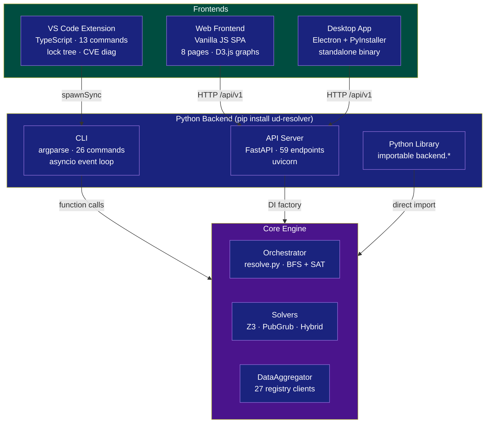

# Components

The Universal Dependency Resolver ships in four forms: a Python backend (CLI/library/API server), a browser-based web frontend, a VS Code extension, and a desktop app.

### Component Relationship



---

## Backend (CLI / Library / API)

The core Python package installed via `pip install ud-resolver`.

### CLI

26 commands accessible via the `udr` console script:

```
auth         Manage API keys and signing keys
check        System compatibility + CVE/license/deprecated/policy checks
completion   Generate shell completion scripts
dependencies Show a package's dependencies and their constraints
details      Show package details from registries
diff         Compare two lock files
export       Export lock file to requirements.txt / Dockerfile etc.
graph        Show dependency trees
index        Manage offline SQLite indexes
init         Initialize a new project
install      Install dependencies using native package managers
list-ecosystems  List all supported package ecosystems
lock         Resolve and write a lock file (core workflow)
migrate      Migrate existing lock files to udr.lock
outdated     List packages with newer versions available
resolve      Resolve compatible versions for one or more packages
sbom         Generate SPDX 2.3 / CycloneDX 1.5 SBOM
scan         Scan a GitHub repo or local path
search       Search for packages across ecosystems
serve        Start the REST API server
system-info  Show detailed system information
tools        Manage plugins and extensions
update       Re-resolve a package and update lock file
verify       Validate a lock file
versions     List available versions of a package
why          Explain why a package version was selected
```

### Library

Core modules importable from Python code:

```python
from backend.orchestrator.resolve import create_solver, ResolutionResult
from backend.core.data_aggregator import DataAggregator
from backend.core.conflict_resolver import ConflictResolver
from backend.core.system_scanner import SystemScanner
from backend.core.license_checker import check_license_compatibility

# Create solver (auto-selects Z3 or PubGrub)
solver = create_solver(use_optimization=True, solver_timeout=30000)
result = solver.resolve_dependencies(packages, system_info, ...)
```

### REST API

59 endpoints across 9 route modules, served by FastAPI + uvicorn:

```
auth      (15 routes)  User registration, login, JWT, API keys, signing keys
check     (5 routes)   CVE, license, deprecated, policy, combined check
completion (1 route)   Shell completion scripts (bash/zsh/fish)
index     (4 routes)   Offline SQLite index management
lock      (15 routes)  Lock generation, verification, signing, diff, etc.
packages  (9 routes)   Search, details, versions, dependencies, resolve, export
sbom      (1 route)    SPDX / CycloneDX generation
scan      (3 routes)   GitHub, local directory, and upload scanning
system    (2 routes)   System info, compatibility check
+ 4 infra routes in main.py: root, healthz, readyz, /api/v1/health
```

### Installation

```bash
# Core (CLI only, minimal dependencies)
pip install ud-resolver

# With SAT solver (Z3)
pip install ud-resolver[z3]

# With PubGrub solver (Rust)
pip install ud-resolver[pubgrub]

# With system detection (GPU, CPU, etc.)
pip install ud-resolver[system]

# With database backends (PostgreSQL, Redis, Celery)
pip install ud-resolver[postgres]

# With monitoring (OpenTelemetry, Prometheus, Sentry)
pip install ud-resolver[monitoring]

# Development tools
pip install ud-resolver[dev]

# Everything
pip install ud-resolver[all]
```

**Python:** 3.11–3.13 **External services:** None required (SQLite by default)

---

## Web Frontend (Browser SPA)

A standalone single-page application served as static files by `udr serve`. Pure vanilla HTML/CSS/JS with D3.js for dependency graphs — no framework, no build step.

### Pages (8 hash-routed views)

| Route | Page | Description |
|-------|------|-------------|
| `#dashboard` | Dashboard | API health, lock summary stats, quick actions |
| `#search` | Package Search | Cross-ecosystem search with detail drill-down |
| `#graph` | Dependency Graph | D3.js force-directed graph (collapsible, zoom/pan) |
| `#lock` | Lock Viewer | Drag-and-drop `udr.lock` upload; verify/outdated/export |
| `#cve` | CVE Check | OSV vulnerability scan (browser→OSV directly); severity coloring |
| `#sbom` | SBOM Generator | SPDX 2.3 / CycloneDX 1.5 generation with download |
| `#policy` | Policy Check | YAML policy upload and validation (10 rule types) |
| `#system` | System Info | Backend scanner results (CPU, GPU, CUDA, runtimes) |

### Quick Start

```bash
# 1. Start backend + frontend together
udr serve                    # serves API at /api/v1, frontend at /

# Or serve separately:
# 2. Start backend
udr serve --port 8199 &

# 3. Serve frontend with any static file server
cd frontend
python -m http.server 3000
# Open http://localhost:3000
```

### Structure

```
frontend/
  index.html       — 255 lines — SPA shell
  css/style.css    — 632 lines — Dark theme, responsive
  js/api.js        — 175 lines — BackendAPI class (fetch wrapper, 20+ methods)
  js/app.js        — 836 lines — Router, state management, page rendering
  js/utils.js      — 480 lines — Formatting, SBOM, OSV queries, policy engine
  tests/           — 2 files, 1037 lines — Jest tests
  package.json     — Jest dev dependency only
```

**Total:** 11 files, 3,525 lines.

### Key Design

- **No build step**: Served as plain HTTP static files
- **Communicates via REST**: `BackendAPI` class wraps `fetch()` calls to the UDR API
- **CVE scanning direct from browser**: Queries `api.osv.dev` directly, not through UDR backend
- **Jest tests**: 21+ tests covering API client, utility functions, SBOM generation, policy engine

---

## VS Code Extension

An editor extension integrating `udr` into VS Code with 13 commands, a lock file tree viewer, CVE diagnostics, and manifest editing.

### Features

- **Lock File Tree View** — "UDR Lock" sidebar panel showing packages grouped by ecosystem with version, license, and CVE count
- **CVE Diagnostics** — Inline squiggly underlines on vulnerable package names in `udr.lock`; Problems panel entries with severity, CVE ID, and fix version
- **13 Commands** — Accessible from the Command Palette (Ctrl+Shift+P)
- **Manifest Editing** — Right-click in manifest files to add, update, or remove dependencies
- **Status Bar** — Auto-refresh on lock file save; shows CVE warnings

### Commands

| Command ID | Title | What it does |
|---|---|---|
| `udr.check` | UDR: Check lock file | `udr check --cve --deprecated` |
| `udr.updatePackage` | UDR: Update package | Prompts for name, runs `udr update <pkg>` |
| `udr.generateSbom` | UDR: Generate SBOM | `udr sbom` |
| `udr.verify` | UDR: Verify lock | `udr verify` |
| `udr.checkPolicies` | UDR: Check policies | `udr check --policy` |
| `udr.fixCves` | UDR: Fix CVEs | `udr update --fix-cve` |
| `udr.lock` | UDR: Lock (resolve) | `udr lock` |
| `udr.lockCheck` | UDR: Lock check (CI) | `udr lock --check` |
| `udr.showGraph` | UDR: Show dependency graph | `udr graph` (webview) |
| `udr.refreshLockView` | UDR: Refresh lock view | Refresh tree view |
| `udr.addDependency` | UDR: Add dependency | Prompt → edit manifest |
| `udr.updateDependency` | UDR: Update dependency | Prompt → edit manifest |
| `udr.removeDependency` | UDR: Remove dependency | Prompt → edit manifest |

### Settings

| Setting | Type | Default | Description |
|---|---|---|---|
| `udr.cliPath` | string | `"udr"` | Path to the `udr` CLI executable |
| `udr.lockFileName` | string | `"udr.lock"` | Lock file name in workspace |
| `udr.autoCheckOnSave` | boolean | `true` | Auto-run CVE check on save |
| `udr.cveSeverityThreshold` | enum | `"MEDIUM"` | Min severity for Problems panel |

### Quick Start

```bash
# Prerequisite: udr CLI must be on PATH
pip install ud-resolver
udr --version

# In VS Code: install the .vsix from Releases
# Or: code --install-extension udr-vscode-0.1.0.vsix
```

### Architecture

```
vscode-extension/
  package.json              (169 lines)  — 13 commands, 4 settings, 7 activation events
  src/
    extension.ts            ( 61 lines)  — activate/deactivate, command registration
    cliRunner.ts            ( 58 lines)  — spawnSync wrapper for `udr` CLI
    cveDiagnostics.ts       ( 75 lines)  — CVE problem markers + lock file watcher
    lockFileProvider.ts     ( 86 lines)  — "UDR Lock" TreeDataProvider
    manifestEditor.ts       (124 lines)  — Add/update/remove deps (requirements.txt, pyproject.toml, package.json)
  test/
    extension.test.ts       ( 23 lines)  — 3 smoke tests
```

**Total:** 13 files, 719 lines (including config/docs).

### Key Design

- **CLI-only integration**: Communicates with UDR exclusively by shelling out to `udr` CLI via `child_process.spawnSync()` — no Python imports, no REST API calls
- **Sync calls**: All commands block the editor UI until the CLI finishes (deliberate simplicity)
- **Direct lock file parsing**: Tree view reads `udr.lock` via `readFileSync` — no CLI output parsing
- **7 activation events**: Activates on workspace containing `udr.lock`, `requirements.txt`, `package.json`, `Cargo.toml`, `pyproject.toml`, `go.mod`, or `udr-policy.yaml`
- **3 smoke tests**: Extension presence, command registration count, tree view creation

---

## Desktop (Electron App)

A cross-platform standalone binary bundling the backend (compiled via PyInstaller) with an HTML/CSS/JS GUI.

### Platforms

| Platform | Format | Download |
|---|---|---|
| Windows x86_64 | `.exe` | Releases page |
| macOS Intel | `.dmg` | Releases page |
| macOS Apple Silicon | `.dmg` | Releases page |
| Linux x86_64 | `.AppImage` | Releases page |
| Linux ARM64 | `.AppImage` | Releases page |

### Interface

17 tabs organized across 4 sections:

**Overview:** Dashboard
**Packages:** Resolve, Search, Details, Versions, Dependencies, Compatibility
**System:** System Info
**Project:** Scan, Graph, SBOM, Lock, Check, Verify, Install, Restore, Update

### Quick Start (CLI)

```bash
udr lock                          # Resolve and lock dependencies
udr check                         # System compatibility check
udr check --cve                   # Vulnerability scan
udr graph flask                   # Dependency tree
```

### Quick Start (Python Library)

```python
from backend.orchestrator.resolve import create_solver
from backend.core.data_aggregator import DataAggregator
from backend.core.system_scanner import SystemScanner

aggregator = DataAggregator()
scanner = SystemScanner()
system_info = scanner.scan_all()

package_data = aggregator.get_package_info("numpy", "pypi")
solver = create_solver()
result = solver.resolve_dependencies(
    packages=[{"name": "numpy", "ecosystem": "pypi", "version": ">=1.20"}],
    system_info=system_info,
)
print(result)
```

### Quick Start (REST API)

```bash
# Start the server
udr serve

# Resolve dependencies
curl -X POST http://localhost:8000/api/v1/packages/resolve \
  -H "Content-Type: application/json" \
  -d '{"packages": [{"name": "flask", "ecosystem": "pypi", "version": ">=2.0"}]}'

# Check lock file for CVEs
curl -X POST http://localhost:8000/api/v1/check/cve \
  -H "Content-Type: application/json" \
  -H "X-API-Key: $API_KEY" \
  -d '{"packages": {"numpy": {"ecosystem": "pypi", "version": "1.24.0"}}}'
```
