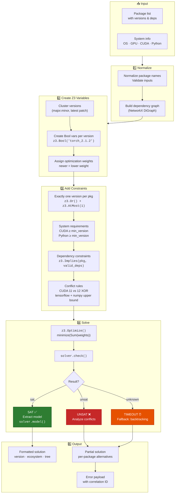

# Performance

## SAT solver internals

**Key implementation details:**
- Z3 boolean variables are created per package version (`z3.Bool(f"{name}_{version}")`)
- Exactly-one constraint enforced via `z3.Or()` + `z3.AtMost(1)` per package
- Dependency constraints use `z3.Implies(pkg_var, Or(valid_dep_vars))`
- CUDA 11 vs 12 conflict: `z3.Not(And(var11, var12))` for each pair
- `SOLVER_MAX_VARS` env var (default 5000) prevents memory blowup
- Version clustering caps at 50 versions per package via `SOLVER_MAX_VERSIONS_PER_PKG`
- When UNSAT/timeout, falls back to DFS backtracking in `_resolve_with_alternatives()`

## Startup time

The CLI starts in ~0.85s on a modern machine. This is achieved through:

- **Lazy `import z3`**: Z3 is imported inside 7 methods of `ConflictResolver`, not at module level. Commands that don't need resolution (e.g. `udr check`, `udr list-ecosystems`) skip Z3 entirely.
- **Lazy data source clients**: All 20 ecosystem clients are registered via `importlib.import_module()` in `_register_client()` builders. They are only imported when first accessed.
- **Lazy aggregator**: `DataAggregator` creates clients on demand.

## Resolution performance

- Simple resolutions (1-3 packages, single ecosystem): <1s (after metadata fetch)
- Complex resolutions (multi-ecosystem, many constraints): depends on Z3 solver time

## Caching

| Layer | Type | Default TTL |
|---|---|---|
| Package metadata | DictCache (in-memory) or Redis | 1 hour |
| Resolution results | DictCache or Redis | 1 hour |
| System info | DictCache (5-min TTL) | 5 minutes |
| System scan results | In-memory, refreshed per resolve | Per request |

## Network

- All registry API calls use `aiohttp` with connection pooling
- Concurrent fetching via `asyncio.gather` for package metadata
- 5-second timeout on individual registry requests
- Configurable rate limits per ecosystem (default: 60-600 req/min)

## Desktop app

- Backend runs as a subprocess on a local port
- GUI communicates via localhost REST API (no network overhead)
- No Python install needed — compiled to standalone binary via PyInstaller

## Bottlenecks

- **First-ever resolution** for a package requires remote API calls. Subsequent resolutions hit cache.
- **Z3 solver** time scales with constraint complexity. Simple version ranges are fast; complex cross-ecosystem constraints take longer.
- **System scanning** GPU detection via `pynvml` is fast (<100ms). Full system scan <500ms.
