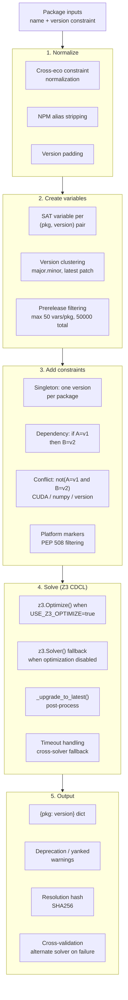

# Performance

## Solver Pipeline

The core resolution engine performs SAT solving (Z3 by default, PubGrub as opt-in) with the following pipeline:

```mermaid
flowchart TD
    IN["Package inputs<br/>name + version constraint"] --> N

    subgraph N["1. Normalize"]
        A1["Cross-eco constraint<br/>normalization"]
        A2["NPM alias stripping"]
        A3["Version padding"]
    end

    N --> V

    subgraph V["2. Create variables"]
        B1["SAT variable per<br/>(pkg, version) pair"]
        B2["Version clustering<br/>major.minor, latest patch"]
        B3["Prerelease filtering<br/>max 50 vars/pkg, 50000 total"]
    end

    V --> C

    subgraph C["3. Add constraints"]
        C1["Singleton: one version<br/>per package"]
        C2["Dependency: if A=v1<br/>then B=v2"]
        C3["Conflict: not(A=v1 and B=v2)<br/>CUDA / numpy / version"]
        C4["Platform markers<br/>PEP 508 filtering"]
    end

    C --> S

    subgraph S["4. Solve (Z3 CDCL)"]
        D1["z3.Optimize() when<br/>USE_Z3_OPTIMIZE=true"]
        D2["z3.Solver() fallback<br/>when optimization disabled"]
        D3["_upgrade_to_latest()<br/>post-process"]
        D4["Timeout handling<br/>cross-solver fallback"]
    end

    S --> O

    subgraph O["5. Output"]
        E1["{pkg: version} dict"]
        E2["Deprecation / yanked<br/>warnings"]
        E3["Resolution hash<br/>SHA256"]
        E4["Cross-validation<br/>alternate solver on failure"]
    end
```

Notes on the pipeline:

- **1. Normalize** — npm `^` → `>=`, `<=`, `~` → PEP 440; Go pseudo-versions → semver; bare versions → `==` bound.
- **2. Create variables** — one SAT boolean variable per (package, version) pair, clustered by `major.minor`.
- **3. Add constraints** — exactly one version per package, dependency implications, conflict exclusions, and PEP 508 platform markers.
- **4. Solve** — `z3.Optimize()` when `USE_Z3_OPTIMIZE=true`, otherwise plain `z3.Solver()` followed by `_upgrade_to_latest()` to prefer newest versions; timeouts fall back to a parallel cross-solver (PubGrub) validation.
- **5. Output** — version assignments plus deprecation warnings, a SHA256 resolution hash, and alternate-solver cross-validation on failure.

## Startup Time

- **Cold start** (from pip install): ~0.85s to `udr --help`
- **Lazy imports**: Heavy dependencies (Z3, aiohttp, cryptography) imported only when the specific command needs them
- **Warm cache**: System scanner results cached for 5 minutes

## Resolution Performance

| Scenario | Packages | Time | Solver |
|---|---|---|---|
| Small (flask + deps) | 15-25 | ~15s | Z3 |
| Medium (express + deps) | 60-80 | ~45s | Z3 |
| Large (sentry: npm + pypi) | 1,567 | ~144s | Z3 |
| Large (cilium: gomodules) | 490 | ~225s | Z3 |
| Workspace (rust-lang/regex) | 21 | ~59s | Z3 |

**Key factors:**
- Registry API latency dominates (50-80% of total time)
- BFS dependency discovery scales with graph size, not solver time
- Z3 SAT solving is typically <5s for most real-world graphs
- Go proxy latency is the main bottleneck for gomodules (~2s per .mod fetch × 320 modules / 20 concurrent ≈ 32s minimum)

## Caching

| Layer | Location | TTL | Purpose |
|---|---|---|---|
| DictCache | In-memory | 3600s | Registry API responses (JSON) |
| DictCache (short) | In-memory | 300s | Rate-limited endpoints |
| DictCache (versions) | In-memory | 600s | Package version listings |
| ContentAddressedCache | `~/.cache/udr/cac/` | configurable | SHA256-verified blob store |
| SQLite Indexes | `~/.cache/udr/indexes/` | permanent | Offline package metadata |
| Redis (optional) | External | 3600s | Worker-shared cache + rate limiting |

## Network Concurrency

| Setting | Default | Description |
|---|---|---|
| `NPM_CONCURRENCY` | 10 | Concurrent npm registry requests |
| `GOMODULES_CONCURRENCY` | 20 | Concurrent Go proxy requests |
| `BFS_BATCH_SIZE` | 20 | Batch size for BFS dependency discovery |
| `SCANNER_MAX_WORKERS` | 10 | Thread pool for system scanning |

## Bottlenecks (Known)

| Bottleneck | Impact | Mitigation |
|---|---|---|
| Go proxy latency | ~2s per `.mod` fetch | Increase `GOMODULES_CONCURRENCY`, use `go.sum` as lock source |
| Conda multi-arch metadata | Slow for large env files | Use offline indexes |
| APT BFS explosion | Many system-level transitive deps | Limit depth with `--timeout` |
| Fresh cold cache | First run fetches all registry data | Pre-populate with `udr index build` |
| PubGrub pure-Python fallback | ~10× slower than Rust backend | Install `pubgrub-py` (Rust) |

## Desktop App

- Backend bundled via PyInstaller (single executable, ~110-120 MB)
- Communicates with local backend via HTTP on `127.0.0.1:8000`
- No rendering latency — plain HTML/CSS/JS with async fetch patterns
- Same performance profile as CLI for all resolution tasks
