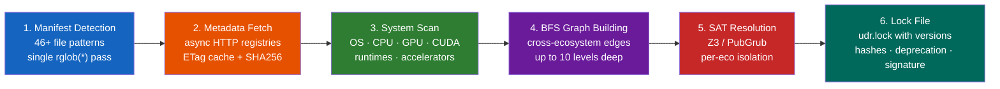

# User Guide

## 1. Who This Is For

| You… | The problem | What UDR does |
|---|---|---|
| **Run a multi-language monorepo** | pip + npm + cargo + go — each its own lock file, its own audit tool, its own version scheme. The same dep pinned to different versions across ecosystems? No tool catches it. | One `udr.lock` across all ecosystems. `udr lock --check` in CI catches cross-ecosystem version drift before prod. |
| **Deploy ML models with GPU deps** | torch + CUDA toolkit + nvidia-* wheels — wrong variant means silent CPU fallback or crash. | Auto-detects CUDA version, selects correct `torch+cu121` variant. CUDA 11-vs-12 conflict rules prevent incompatible pairs. |
| **Own supply chain compliance** | Quarterly audits = run `pip-audit` + `npm audit` + `cargo audit` separately. | `udr check --cve` against OSV across **18 ecosystems** at once. `udr sbom` for SPDX/CycloneDX. Done. |

## 2. Introduction

**Universal Dependency Resolver (UDR)** is a cross-ecosystem dependency resolution tool. It resolves, locks, and exports dependencies across **25 package ecosystems** (18 resolvable + 7 query-only) using SAT solvers (Z3 or PubGrub) that find compatible versions even across ecosystem boundaries.

Your project pulls in packages from everywhere — Python scripts call Node services, Docker images need both `pip` and `apt` packages. Existing tools only work within one ecosystem. Cross-ecosystem conflicts go undetected until something breaks at runtime.

**UDR fixes that.**

## 3. Quick Start

```bash
# Install
pip install ud-resolver

# Auto-detect manifests in current directory, lock everything
udr lock

# Check for CVEs
udr check --cve

# See the dependency tree
udr graph

# Generate SBOM
udr sbom
```

That's it. `udr lock` auto-detects your dependency files (requirements.txt, package.json, Cargo.toml, go.mod, etc.), resolves all constraints across ecosystems into a single `udr.lock`, and writes the result.

## 4. How It Works


```mermaid
flowchart LR
    A["1. Manifest Detection<br/>46+ file patterns<br/>single rglob(*) pass"] --> B
    B["2. Metadata Fetch<br/>async HTTP registries<br/>ETag cache + SHA256"] --> C
    C["3. System Scan<br/>OS · CPU · GPU · CUDA<br/>runtimes · accelerators"] --> D
    D["4. BFS Graph Building<br/>cross-ecosystem edges<br/>up to 10 levels deep"] --> E
    E["5. SAT Resolution<br/>Z3 / PubGrub<br/>per-eco isolation"] --> F
    F["6. Lock File<br/>udr.lock with versions<br/>hashes · deprecation · signature"]

    style A fill:#1565c0,color:#fff
    style B fill:#e65100,color:#fff
    style C fill:#2e7d32,color:#fff
    style D fill:#6a1b9a,color:#fff
    style E fill:#c62828,color:#fff
    style F fill:#00695c,color:#fff
```

### The resolution pipeline

1. **Manifest detection** — Recognizes 90+ file patterns (package.json, pyproject.toml, setup.py, Cargo.toml, go.mod, Gemfile, etc.). Scans directory tree efficiently with a single `rglob("*")` pass.
2. **Metadata fetch** — Fetches versions and dependencies from registries (PyPI, npmjs.org, crates.io, etc.) using async HTTP with connection pooling. Cached locally (DictCache TTL 1h, ContentAddressedCache by SHA256).
3. **System scan** — Detects OS/kernel, CPU model/cores, GPU model/VRAM, CUDA version, runtimes (Python, Node.js, Java, GCC), accelerators (TPU, NPU, Apple Neural Engine).
4. **BFS graph building** — Builds the full transitive dependency graph across all ecosystems. Cross-ecosystem edges are tracked and resolved in a unified SAT model.
5. **SAT resolution** — Z3 (default) or PubGrub (opt-in) solver finds a set of mutually compatible versions. If the graph is large, packages are grouped by ecosystem for independent resolution before cross-ecosystem unification.
6. **Lock file** — `udr.lock` contains all resolved versions, system snapshot, integrity hashes, deprecation flags, and optional Ed25519 signature.

## 5. Key Concepts

### Cross-ecosystem resolution

UDR is the only tool that resolves dependencies across ecosystem boundaries. A Python package depending on a Node.js package through a system call? UDR tracks that edge and ensures version compatibility across both ecosystems.

### SAT solver (Z3 / PubGrub)

Finding compatible versions across multiple packages with overlapping constraints is a SAT problem. UDR supports two backends:
- **Z3** (default) — Industrial-strength SMT solver. Handles CUDA XOR constraints, cross-eco variable encoding.
- **PubGrub** (opt-in via `USE_PUBGRUB_SOLVER=true`) — CDCL algorithm designed for dependency resolution. Can be faster on pure version-constraint graphs.

Both backends use the same input format and produce the same output. If the primary solver fails, the alternate solver runs for cross-validation.

### GPU-aware resolution

For PyPI packages with CUDA-tagged variants (e.g. `torch 2.1.2+cu121`, `torch 2.1.2+cu118`), UDR auto-detects the system CUDA version and selects the best match. On CPU-only machines, use `--cuda 12.1` to force CUDA-aware resolution.

### Supply chain features

- **CVE scanning**: Queries OSV database for all packages in the lock file — 18 ecosystems supported.
- **SBOM generation**: SPDX 2.3 or CycloneDX 1.5 output.
- **Lock file signing**: Ed25519 signatures with auto-generated key pairs.
- **SLSA provenance**: Build metadata tracked in lock file.
- **Policy engine**: YAML-based rules (no-deprecated, no-gpl, max-vulnerabilities, etc.).

## 6. Workflows

### Daily development

```bash
# Lock dependencies
udr lock

# Check for CVEs before committing
udr check --cve

# Update a package
udr update flask

# See why a specific version was chosen
udr why flask
```

### CI/CD

```bash
# Drift check — exits 1 if lock file is stale
udr lock --check

# Full CVE scan
udr check --cve

# Generate SBOM for artifact
udr sbom --format spdx --output sbom.json
```

### Cross-compilation

```bash
# Resolve for a different target
udr lock --target linux --platform arm64

# With specific CUDA version
udr lock --cuda 12.1 --target linux --platform x86_64
```

### Vulnerability fix

```bash
# Fix all vulnerable packages to minimum fixed versions
udr update --fix-cve

# Fix a specific package
udr update flask --fix-cve
```

## 7. Python Library Usage

```python
import asyncio
from backend.core.data_aggregator import DataAggregator
from backend.orchestrator import create_solver
from backend.core.system_scanner import SystemScanner

async def main():
    scanner = SystemScanner()
    system_info = await scanner.scan_all()

    aggregator = DataAggregator()
    info = await aggregator.get_package_info(
        "torch", ecosystem="pypi",
        include_dependencies=True, include_versions=True,
    )

    resolver = create_solver()
    result = resolver.resolve_dependencies(
        packages=[{"name": "flask", "version": ">=2.0"}],
        system_info=system_info,
    )

asyncio.run(main())
```

See [SDK Roadmap](SDK_ROADMAP.md) for upcoming Python SDK features (vulnerability checking, license checking, SBOM generation).

## 8. Where to Go Next

| Resource | What it covers |
|---|---|
| [CLI Reference](CLI.md) | All 26 commands with flags, examples, and exit codes |
| [API Reference](API.md) | 59 REST endpoints with request/response schemas |
| [Architecture](ARCHITECTURE.md) | Codebase structure, layers, design decisions |
| [Components](COMPONENTS.md) | CLI vs Desktop vs Library comparison |
| [Development](DEVELOPMENT.md) | Setup, testing, project structure |
| [Deployment](DEPLOYMENT.md) | Production deployment guide |
| [Performance](PERFORMANCE.md) | SAT solver benchmarks, caching, optimization tips |
| [Desktop](DESKTOP.md) | Desktop app build and usage (17 tabs) |
| [Troubleshooting](TROUBLESHOOTING.md) | Common issues and solutions (432 lines) |
| [API Integration](API_INTEGRATION.md) | Third-party integration guide |
| [FAQ](FAQ.md) | Frequently asked questions (12 items) |
| [SDK Roadmap](SDK_ROADMAP.md) | Python SDK and future plans |
