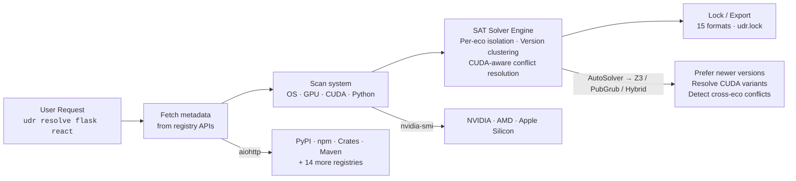

# Universal Dependency Resolver

<p align="center">
  <strong>Resolve any package, from any ecosystem, all at once.</strong>
</p>

<p align="center">
  <a href="https://pypi.org/project/ud-resolver/"></a>
  <a href="https://pypi.org/project/ud-resolver/"></a>
  <a href="https://github.com/code-with-zeeshan/universal-dependency-resolver/blob/main/LICENSE"></a>
  <a href="https://github.com/code-with-zeeshan/universal-dependency-resolver/actions/workflows/ci.yml"></a>
  <a href="https://github.com/code-with-zeeshan/universal-dependency-resolver/actions"></a>
  <a href="https://github.com/code-with-zeeshan/universal-dependency-resolver/actions"></a>
  <a href="https://github.com/code-with-zeeshan/universal-dependency-resolver/actions"></a>
  <a href="https://github.com/code-with-zeeshan/universal-dependency-resolver/actions"></a>
</p>

---

## One tool for all your dependencies

<div class="grid cards" markdown>

-   :material-package-variant-closed:{ .lg .middle } **25 Ecosystems**

    ---

    Resolve dependencies across **PyPI, npm, Crates.io, Go Modules, Maven, RubyGems, NuGet, Conda, APT, APK, and 17 more** — all in one lock file.

    [:octicons-arrow-right-24: See the full list](USER_GUIDE.md#supported-ecosystems)

-   :material-chip:{ .lg .middle } **System-Aware**

    ---

    Auto-detects **OS, CPU, GPU, CUDA version**. Selects the right `torch+cu121` variant. ROCm and Metal supported too.

    [:octicons-arrow-right-24: Learn more](USER_GUIDE.md#system-aware-resolution)

-   :material-shield-check:{ .lg .middle } **Supply Chain Security**

    ---

    Scan **CVEs across 18 ecosystems** at once. Generate SPDX/CycloneDX SBOMs. Sign lock files with Ed25519.

    [:octicons-arrow-right-24: Check features](USER_GUIDE.md#supply-chain-security)

-   :material-speedometer:{ .lg .middle } **SAT-Powered Solver**

    ---

    Auto-selects Z3, PubGrub, or Hybrid solver per workload. Version clustering. Per-ecosystem isolation. CUDA-aware conflict rules.

    [:octicons-arrow-right-24: How it works](ARCHITECTURE.md)

-   :fontawesome-solid-terminal:{ .lg .middle } **24 CLI Commands**

    ---

    `udr lock`, `udr check`, `udr sbom`, `udr graph`, `udr diff`, `udr why` — full toolkit for CI/CD and daily use.

    [:octicons-arrow-right-24: CLI reference](CLI.md)

-   :material-api:{ .lg .middle } **59 REST API Endpoints**

    ---

    Full programmatic API with Swagger docs. Authentication, rate limiting, webhooks.

    [:octicons-arrow-right-24: API reference](API.md)

</div>

---

## Quick Start

```bash
# Install
pip install ud-resolver

# For full capacity (SAT solvers + system detection):
pip install "ud-resolver[z3,pubgrub,system]"

# Resolve packages from any ecosystem
udr resolve flask>=2.0 react@^18 serde@crates

# Lock your entire project
udr lock

# Check CVEs across all dependencies
udr check --cve

# Start the API server
udr serve --port 8000
```

---

## By the Numbers

| Metric | Value |
|---|---|
| :white_check_mark: Supported ecosystems | **25** (18 resolvable + 7 query-only) |
| :microscope: Tests passing | **3681 unit + 96 integration + 77 e2e** |
| :control_knobs: CLI commands | **24** |
| :globe_with_meridians: API endpoints | **59** |
| :outbox_tray: Export formats | **15** |
| :package: PyPI downloads | [](https://pepy.tech/project/ud-resolver) |

---

## How It Works



---

## Components

| Component | What it is | Best for |
|---|---|---|
| :desktop: **CLI** | Terminal tool with 24 commands | CI/CD, scripts, ad-hoc |
| :books: **Python Library** | Importable `backend.*` modules | Embedding in tools |
| :globe_with_meridians: **API Server** | FastAPI REST server + Swagger UI | Programmatic access |
| :desktop: **Desktop App** | Standalone Electron GUI | GUI users, no terminal |
| :earth_africa: **Web UI** | Browser-based SPA | Lightweight browser access |
| :memo: **VS Code Extension** | In-editor dependency management | Developers using VS Code |

---

## Get Involved

:material-bug: Found a bug? [Open an issue](https://github.com/code-with-zeeshan/universal-dependency-resolver/issues)  
:material-lightbulb: Want a feature? [Suggest it](https://github.com/code-with-zeeshan/universal-dependency-resolver/issues)  
:material-star: Love the tool? [Star the repo](https://github.com/code-with-zeeshan/universal-dependency-resolver)

---

[MIT](https://github.com/code-with-zeeshan/universal-dependency-resolver/blob/main/LICENSE) &mdash; free for personal and commercial use.
